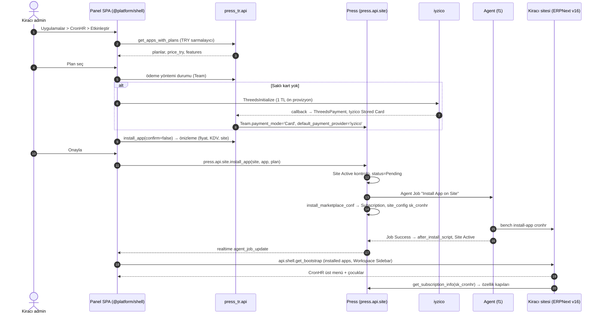

Press v0.154.x ticari katmanın omurgasıdır: Site Plan, Marketplace App / App Plan, Subscription → Usage Record → Invoice zinciri, Team Tier, Product Trial standby havuzu ve App Source → Release Group → Deploy Candidate → Bench → Site Update dağıtım zinciri olduğu gibi kullanılır (doğrulandı). Frappe Cloud'a özgü varsayımları kendi ticari gerçekliğimize uyarlayan tek özel uygulama `press_tr`dir (G-7): ödeme, TRY, e-belge köprüsü, fixture temizliği, auth allowlist, Keycloak sarmalayıcıları ve Türkçe e-posta şablonları `hooks`, `override_doctype_class`, `doc_events` ve Custom Field ile burada yaşar; Press'te düzeltme gerektiren noktalar ayrıca upstream PR olarak açılır.

## 1. Aktivasyon akışı (G-29, G-30, G-35, G-95)

Satın alma ödeme → abonelik → kurulum geçişleri tek durum makinesidir; yinelenen callback, kayıp iş sonucu ve ödeme alınıp kurulumun başarısız olduğu durumların telafisi G-125'tedir. Sabit kurallar: `install_app` yalnızca Site `Active` iken kabul edilir; Pending/Updating durumunda panel düğmeyi pasifler ve isteği kuyruğa alır (G-30). Her Free/Freemium uygulama için `price_usd=0` olan enabled bir Marketplace App Plan ve `run_after_install_script=1` şarttır; aksi halde Subscription ve `sk_<app>` anahtarı yazılmaz (doğrulandı, G-29). Kaldırma `press.api.client.run_doc_method(dt='Site', method='uninstall_app', args={app, create_offsite_backup, feedback})`, plan değişimi `change_app_plan` / `change_plan` + Site Plan Change ile yapılır. Ücret etkili her aksiyon önizle → onayla sözleşmesinden geçer; AI sağ paneli aynı araçları `press_tr.mcp.handler` üzerinden `confirm` bayrağıyla çağırır (G-27).

## 2. Plan ve tier modeli (G-9, G-10, G-25)

| Katman | Press nesnesi | Karar |
| --- | --- | --- |
| Site planı | Site Plan: Trial (is\_trial\_plan=1, 14 gün), Başlangıç, Büyüme, Kurumsal | cpu\_time\_per\_day, max\_database\_usage, max\_storage\_usage, offsite\_backups=1, release\_groups = ERPNext v16 TR, roles ile görünürlük |
| Uygulama planı | Marketplace App Plan (CronHR, CRM, Webshop) | interval Monthly, available\_on\_versions 'Version 16', features listesi (AI kotası dahil, G-92), her uygulamada bir ücretsiz plan |
| Para birimi | `price_try` Custom Field + USD karşılığı | `Team.before_insert` country='Türkiye' → currency='TRY'; `get_price_per_day` override TRY seçer; ücretli-uygulama kapıları `price_usd` okuduğu için her TRY planına USD karşılığı yazılır (doğrulandı) |
| Harcama sınırı | Team Tier, spending\_limit (USD eşdeğeri), apply\_limits=1 | `check_budget_alerts` eşiği panelde TRY ile ayarlanır; `billing_forecast` faturalama ekranında |
| Fiyat değişikliği | Yeni Site Plan kaydı; eski plan legacy\_plan=1 + allow\_downgrading\_from\_other\_plan | Fiyat anında yürürlüğe girer (doğrulandı); 30 gün önce e-posta + Press Notification, zamanlanmış Site Plan Change |

Faturalama defteri Press'in yerel zinciridir: Subscription → `create_usage_records` → taslak Invoice → günlük `finalize_monthly_draft_invoices`. Dunning sabitleri (ayın 15'inden sonra askıya alma, 21 gün sonra arşiv, 6 ay yedek saklama, ödemede `unsuspend_sites_if_applicable`) sözleşmeye aynı sayılarla yazılır; erteleme Payment Due Extension ile yapılır (G-24). Rail 6 bu zinciri yapılandırılabilir ve Türkçe hale getirir (SA-13).

## 3. iyzico entegrasyon planı (G-11, G-19, G-20)

Tahsilat modeli: Press abonelik defteri + iyzico saklı karttan tahsilat (ay içi plan değişimi ve kredi modeliyle uyumlu).

1. **Doctype'lar (`press_tr`)**: Iyzico Settings (sandbox/prod anahtarları Password tipli), Iyzico Payment Record, Iyzico Webhook Log, Iyzico Stored Card (Team başına `cardUserKey/cardToken`); Payment Gateway kaydı gateway='iyzico'.
2. **Kart ekleme**: ThreedsInitialize → callback → ThreedsPayment ile 1 TL ön provizyon ve iptal; başarıda `Team.payment_mode='Card'` ve `default_payment_provider='iyzico'` yazılır, çünkü `can_install_paid_apps`/`can_create_site` bu alana bakar (doğrulandı). 3DS ticari tahsilatta standart akıştır (doğrulanacak: mevzuat metni).
3. **Invoice override**: `finalize_invoice` Card dalı `default_payment_provider`'a göre dallanır; iyzico başarı → status Paid, payment\_date, transaction\_\*, submit → unsuspend; başarısızlık → Unpaid, günlük `finalize_unpaid_card_invoices` yeniden dener (doğrulandı). `apply_taxes_if_applicable` TRY + Türkiye → %20 KDV (oran kaynağı Press `Settings.gst_percentage`, etiket 'KDV'), yurt dışı → 0 hizmet ihracı istisnası (mali müşavir teyidi). `transaction_amount` her ödeme yolunda ve Team para birimiyle dolar; aksi halde operasyon sitesine fatura senkronu tetiklenmez (SA-11).
4. **Diğer yollar**: InstallmentInfo taksit; Refund → Invoice.status='Refunded' + Balance Transaction; itiraz → Payment Dispute; `press_tr.api.billing.buy_credits_iyzico` 3DS sonrası Prepaid Credits Invoice; Havale/EFT için payment\_mode değeri 'NEFT' korunur, 'Havale/EFT' etiketi panelde gösterilir, ödeme referans kodu (PRS-…) faturada yer alır ve mutabakat Rail 6'da yapılır (SA-8, SA-34).
5. **Erişim**: `before_request` kancası iyzico callback/webhook yollarını ve `press_tr.api.` wildcard'ını her istekte idempotent olarak allowlist'e ekler; Iyzico doctype'ları `ALLOWED_DOCTYPES` + takım filtreli `get_list_query` ile panele açılır; webhook imzası (`X-IYZ-SIGNATURE-V3`) doğrulanır.

Kabul (P2): sandbox ve prod'da 3DS ile plan satın alma, saklı karttan aylık tahsilat, iade ve Havale/EFT akışları Invoice durum makinesiyle uçtan uca geçer; Press'te kart verisi yalnızca token olarak bulunur.

## 4. e-Fatura / e-Arşiv konumu (G-21, G-22, G-23)

Press ödenen faturayı `create_invoice_on_frappeio` ile dış ERPNext'e gönderir ve PDF'ini çeker (doğrulandı); bu yerel köprü şirketin kendi ERPNext v16 operasyon sitesine (Rail 6) yönlendirilir:

- Press `Settings.frappe_url` = operasyon sitesi, disable\_frappe\_auth=0. Gönderim tetiği finans olay–belge matrisine göredir (SA-41): Press yerel olarak yalnız ödenmiş faturayı gönderir (doğrulandı); kesinleşmede (Unpaid/Paid) gönderim VUK 231/5 yedi gün yorumuna bağlı bir seçenektir ve mali müşavir kararıyla seçilir (K-13); aynı fatura iki yoldan gönderilmez.
- Operasyon sitesinde (P2 finans çekirdeği) `press_tr_finance` uygulaması `create-fc-invoice` alıcısını, Sales Invoice → GİB özel entegratör (UBL-TR) gönderimini ve eşleme tablosunu uygular: Subscription → Sales Invoice + e-belge; Prepaid Credits → K-13 seçeneğine göre satış faturası veya alınan avans; NEFT → banka mutabakatı; Refunded → iade/Credit Note; Payment Dispute → şüpheli alacak; iyzico hakediş mutabakatı (SA-19, SA-21, SA-33).
- Press Invoice'a e\_invoice\_type, ettn, gib\_status, `e_invoice_pdf/xml` geri yazılır; `fetch_invoice_pdf` override GİB onaylı PDF'i Invoice.invoice\_pdf'e koyar, panel bunu indirir (G-96).
- VKN (10 hane) / TCKN (11 hane) algoritmik doğrulama, vergi dairesi, MERSIS ve e-Fatura mükellefi bayrağı Address Custom Field'larıdır (`doc_events validate: press_tr.api.billing.validate_tax_id`); checkout'ta `Team.billing_address` zorunlu ve Team.country == Address.country doğrulanır (Press ön koşulu, doğrulandı). Kayıtlı e-Fatura mükellefine e-Fatura, diğerlerine e-Arşiv düzenlenir.
- Mesafeli satış, ön bilgilendirme ve KVKK aydınlatma onayları Team üzerinde `consent_version/consent_at/consent_ip` ile; pazarlama onayı ayrı alan + İYS kaydı.

Entegratör seçimi ve yükümlülük takvimi P2 başında ürün sahibi ve mali müşavir tarafından kapatılır (doğrulanacak).

## 5. FC fixture ve kimlik yüzeyi temizliği (G-8, G-11, G-12, G-16, G-17)

`press_tr.after_migrate` her migrate'te çalışır; sync\_fixtures silinen kayıtları geri getirir ve yeni `modified` damgalı upstream fixture yerel değişiklikleri ezer (doğrulandı):

| Hedef | İşlem |
| --- | --- |
| 686 FC Site Plan | kendi plan seti dışındakiler enabled=0 |
| 6 FC Team Tier | TRY/USD tablosuyla değerler yeniden yazılır |
| Cloud Region / Server Plan | kullanılmayanlar kapatılır |
| Frappe Version | 'Version 16' default=1 (X-04) |
| Scheduler | `press.signup_e2e.run_signup_e2e` devre dışı (kimlik Keycloak'ta) |
| Roller | v0.8.0 yaması Press Admin/Member → Press User; takım içi yetki Press Role bayrakları (admin\_access, allow\_billing, allow\_apps, allow\_site\_creation, allow\_webhook\_configuration, allow\_local\_payment) ve press\_tr rol şablonları; operatör rolleri Rail 6'da (SA-2) |
| Kimlik uçları | signup/send\_otp/verify\_otp/login\_link/reset\_password/2fa uçları 403; `/login`, `/signup`, `/dashboard/login` Keycloak'a yönlendirilir; Social Login Key provider 'Keycloak', user\_id\_property='sub', sign\_ups='Allow' |
| E-posta | 'Frappe Cloud' içeren 29 şablon + 13 string Türkçe markalı set ile değiştirilir; Press host için Email Account + SPF/DKIM |

## 6. Press altyapı envanteri — Hetzner (G-2..G-6, G-36, G-37)

| Bileşen | Press doctype / ayar | Sahip |
| --- | --- | --- |
| Press host (Frappe v15, Python 3.11, MariaDB, Redis, certbot, docker CLI) | Press Settings (G-4); `panel.` Press'in kendi alan adı, `allow_cors` yok (G-119) | Hüseyin Cengiz |
| n1 proxy (nginx, proxysql, wireguard, ssh\_proxy) | Proxy Server | Hüseyin Cengiz |
| f1 app + build (x86\_64) | Server use\_for\_new\_sites=1, use\_for\_build=1 | Hüseyin Cengiz |
| m1 veritabanı | Database Server (binlog, audit log, replika — G-55) | Hüseyin Cengiz |
| r1 registry | Registry Server + Press Settings docker\_registry\_\* | Hüseyin Cengiz |
| İzleme / log | Monitor Server (Prometheus/Grafana/Alertmanager), Log Server (ES/Kibana), Incident Settings, Telegram + e-posta | Hüseyin Cengiz |
| Yedek | Backup Bucket endpoint `https://fsn1.your-objectstorage.com`, GFS rotasyonu, fsn1→nbg1 `rclone sync --immutable`, Agent endpoint\_url yaması (upstream PR), RPO ≤ 24 s, aylık Backup Restoration Test | Hüseyin Cengiz |
| Cluster | 'hetzner-fsn1' cloud\_provider='Generic' (bare metal); Hetzner Cloud VM'ler 'Hetzner' | Hüseyin Cengiz |
| DNS / TLS | Route 53 hosted zone + sınırlı IAM; Root Domain dns\_provider='AWS Route 53'; wildcard certbot `--dns-route53` | Hüseyin Cengiz (Route 53/IAM, sonuç doğrulama) |
| NS delegasyonu | `app.<marka>.com.tr` NS kayıtları GoDaddy'de Route 53'e; kiracılar `<kiracı>.app.<marka>.com.tr`, sabit host'lar GoDaddy'de (K-2) | Asistan Hüseyin (uygular), Hüseyin Cengiz (değer, doğrulama) |
| Operasyon sitesi (Rail 6) | Kendi Team'inde Release Group 'ops'; `ops.<marka>.com.tr`; P2 finans çekirdeği, P6 CRM/Helpdesk (SA-17) | Hüseyin Cengiz; DNS Asistan Hüseyin |
| Hocuspocus (Rail 6 destek oturumu) | Ayrı Node servisi + Redis, reverse proxy TLS (SA-29) | Hüseyin Cengiz |
| Sürüm takibi | v0.155.x+ staging Press'te `bench migrate` + press\_tr testleri + aktivasyon E2E, sonra prod bakım penceresi | Hüseyin Cengiz |
| Trace / Analytics (SHOULD) | Trace Server (GlitchTip), Analytics Server (Plausible; birinci taraf ürün analitiği adayı, rıza kapısı ve yüzey kuralları G-134) | Hüseyin Cengiz |
| Güvenlik danışmanlığı | Danışmanlık izleme ve karar kaydı; acil yama rutin takvimi beklemez (G-142, K-26) | Hüseyin Cengiz |

Kabul (P0): `dig NS` Route 53 sunucularını döner, wildcard TLS Certificate Active, test sitesi Active, offsite yedek bucket'ta listelenir ve geri yüklenir, Grafana/Kibana uyarıları Telegram'a düşer.
