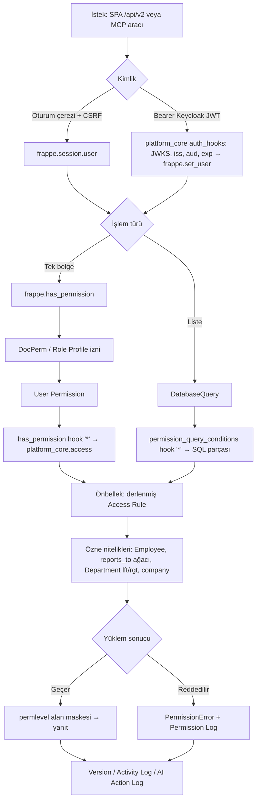

Bu ray, Frappe v16 / ERPNext v16 kiracı sitelerinde özel kodun tek evi olan `platform_core` uygulamasını (G-56) tasarlar. Uygulama, Frappe'nin yerel yetki, meta, denetim ve zamanlayıcı mekanizmalarını kullanır; özel kod yalnızca Frappe'nin sunmadığı altı yeteneğe ayrılır: Access Policy motoru, Meta API, denetim izi, özellik bayrakları, işlemsel outbox ve API sözleşme politikası. Tüm bileşenler P1'de teslim edilir; Keycloak JWT adaptörü (G-59) P3'e, Support Session ve `api.ops.customer_360` (SA-23, SA-27) P6'ya bağlıdır.

## platform\_core modül haritası

| Modül | Bileşen | Frappe mekanizması | G-id |
| --- | --- | --- | --- |
| `access` | Access Rule doctype, derleyici, `has_permission` / `permission_query_conditions` hook'ları, `explain_permission` | Hook'lar, DocPerm, User Permission, permlevel | G-60, G-61, G-62, G-104 |
| `meta` | `api.meta.get_doctype`, `api.shell.get_bootstrap`, meta hash/ETag | `/api/v2/doctype/<doctype>/meta`, `getdoctype`, Workspace Sidebar | G-63, G-94, X-12 |
| `audit` | AI Action Log doctype, saklama işi, correlation-id | Version, Activity Log, Permission Log, Access Log | G-64, G-52, X-05 |
| `flags` | `subscription.has_feature`, `@require_feature`, Platform Settings | site\_config, Press Developer API | G-35, G-106, G-38, G-90 |
| `outbox` | Platform Event doctype, dağıtıcı, ölü mektup | `doc_events`, `scheduler_events`, `frappe.enqueue` | G-15, G-81, G-83, X-12 |
| `identity` | provision, SLO, JWT auth\_hooks | `auth_hooks`, `on_logout`, Social Login Key | G-57, G-58, G-59 |
| `baseline` | TR System Settings, Desk yönlendirme, SPA www sayfası | `setup_wizard_complete`, `before_request`, `www/` | G-41, G-45, G-53, G-75 |
| `support` | Support Session doctype, impersonate kapısı, Hocuspocus `onAuthenticate` doğrulama ucu | `user.impersonate`, Activity Log, Notification Log | SA-27, SA-28, SA-29 |
| `ops` | `api.ops.customer_360` (operatör modu, salt okur birleştirme) | Press API + yerel doctype'lar | SA-23, SA-24 |

## Access Policy motoru: ABAC/ReBAC kuralları Frappe hook'larına derlenir

Yetki üç katmanda çözülür ve her katmanın görevi sabittir: **Role/DocPerm** izin verir, **Access Rule** daraltır, **permlevel** alanı gizler. Frappe v16 kaynak kodu iki kritik gerçeği doğrular: controller hook'ları yalnızca reddedebilir, var olmayan bir izni veremez (`has_controller_permissions`, doğrulandı); hem `has_permission` hem `permission_query_conditions` hook'ları `"*"` wildcard anahtarıyla tüm doctype'lara tek kayıtla bağlanır ve sorgu hook'u `doctype=` parametresini alır (`permissions.py:491`, `db_query.py:1166`, doğrulandı). Bu nedenle `platform_core` hooks.py'de `permission_query_conditions = {"*": "platform_core.access.query_conditions"}` ve `has_permission = {"*": "platform_core.access.has_permission"}` yazılır; uygulama kurulduğu anda tüm satılan doctype'lar motorun kapsamına girer (G-60).

**Access Rule** doctype alanları: `document_type`, `role`, `scope` (own / team / department / company / all), `filters` (JSON; `[["status","=","Open"],["company","=","$user.company"]]` biçiminde ABAC yüklemleri), `read/write/create/delete/submit/cancel` bayrakları, `priority`, `is_active`, `app` (ön ek, fixture filtresi için). Özne nitelikleri `$user`, `$user.employee`, `$user.department`, `$user.company`, `$reports_to_tree` (`Employee.reports_to` zinciri) ve Department ağacı (`lft`/`rgt`) ile çözülür; ReBAC kapsamı budur.

**Derleme:** Access Rule kaydedildiğinde `platform_core.access.compiler` her kuralı iki ürüne çevirir: liste sorguları için parametreli SQL parçası, tek belge için Python yüklemi. Ürünler `frappe.cache()`'te (site, doctype, kural sürümü) anahtarıyla saklanır; Access Rule, User Permission, `Employee.reports_to` veya Department değişikliği önbelleği düşürür. Aynı kullanıcıya uygulanan kurallar birleşimle (OR) bağlanır; kuralı olmayan doctype'ta DocPerm sonucu geçerli kalır. Çözülen özne nitelikleri istek başına `frappe.local` üzerinde tutulur. Alan düzeyi (G-61): permlevel + Custom DocPerm; kiracı admin API'si (G-62) alanları Property Setter ile permlevel gruplarına atar. AI araçları aynı yoldan geçer (G-85); `platform_core.api.access.explain_permission` hangi kuralın reddettiğini döner.

## Meta API ve shell bootstrap

`platform_core.api.meta.get_doctype` Frappe v16'nın yerel `/api/v2/doctype/<doctype>/meta` ucunu (doğrulandı) ve `frappe.desk.form.load.getdoctype` çıktısını sarar; Custom Field, Property Setter ve Custom DocPerm dahil **efektif** alan izinlerini (read/write/hidden) ve Access Rule özetini ekler (G-63). Her yanıt, DocType + Custom Field + Property Setter + Custom DocPerm tablolarının en büyük `modified` değerinden türetilen `meta_hash` taşır; SPA önbelleği site + hash ile anahtarlanır (X-12). Customize Form ve Custom Field `on_update` doc\_event'i `frappe.publish_realtime("meta_changed")` yayınlar ve bir outbox olayı yazar. `api.shell.get_bootstrap` tek çağrıda kullanıcı/roller, kurulu uygulamalar, rollere göre filtrelenmiş Workspace Sidebar ağacı (G-94), özellik kapıları, biçim bilgisi, Tenant Branding, aktif Support Session durumu ve csrf döner.

## Denetim izi

| Kayıt | Kaynak | Saklama (G-52) |
| --- | --- | --- |
| Version (alan farkları) | `track_changes=1` satılan tüm doctype'larda | belge ömrü |
| Activity Log, Access Log | Frappe yerel | 365 gün |
| Permission Log, Deleted Document | Frappe yerel; LogType protokolüne uymadığı için `platform_core` günlük işiyle temizlenir | 365 gün |
| AI Action Log | `platform_core` doctype: session\_id, user, model, tool, args\_hash, target doctype/name, preview\_hash, confirm durumu, sonuç, token/maliyet, ip, `request_id` | 365 gün (G-87) |
| Support Session | `platform_core` doctype: operatör, kapsam kademesi, rıza sürümü, başlangıç/bitiş, Hocuspocus oda kimliği, bağlı HD Ticket | saklama matrisi (SA-36) |

`X-Request-Id` başlığı `before_request`'te okunur, Activity Log ve AI Action Log kayıtlarına Custom Field olarak yazılır ve outbox olaylarına taşınır (X-05); AI Action Log ilgili Version kaydına Link ile bağlanır (G-64).

## Özellik bayrakları ve abonelik kapıları

Üç kaynak, tek okuma noktası: (1) plan kapıları `platform_core.subscription.has_feature(app, feature)` Press Developer API sonucunu `sk_<app>` anahtarıyla çeker ve 15 dakika önbellekler (G-35, G-106); (2) operasyonel bayraklar Press Site.configuration üzerinden site\_config'te tutulur (G-38); (3) kiracı admin anahtarları (örn. `ai_enabled`, G-90) `Platform Settings` Single doctype'ında yaşar. Sunucu tarafı `@require_feature(app, feature)` dekoratörü whitelisted metotları ve doc\_events kontrolünü kapatır; UI aynı değeri bootstrap'tan okur. Deneme bitişi, plan düşürme ve askıya almada salt okunur mod kapıdan türetilir.

## Outbox: işlemsel giden kutusu

`Platform Event` doctype'ı (event\_type, `ref_doctype/ref_name`, payload JSON, idempotency\_key, correlation\_id, status Pending/Sent/Failed/Dead, attempts, next\_attempt\_at) iş belgesiyle aynı veritabanı işleminde `doc_events` içinden yazılır; Frappe isteği tek işlemde commit ettiği için olay ve belge birlikte kalıcı olur. Dağıtıcı `scheduler_events.cron` ile dakikada bir çalışır, HMAC imzalı HTTPS ile agent servisine (G-83) ve identity-sync'e (G-81) teslim eder, üstel geri çekilme ve beş denemeden sonra Dead durumuna alır; tüketiciler idempotency\_key ile yinelemeyi bastırır. Olay kataloğu: `meta_changed`, `user_provisioned`, `user_disabled`, `access_rule_changed`, `ai_action_logged`, `subscription_changed`, `personal_data_request`, `support_session_changed`. Dağıtıcı `long` kuyruğunda çalışır; worker boyutlandırması G-50'ye göre Hüseyin Cengiz tarafından Release Group'ta ayarlanır. Press tarafındaki karşılığı press\_tr `doc_events` kanalı (G-15) ve Rail 6'ya giden `press_ops_bridge` (SA-22) kanalıdır.

## API sözleşme politikası

- **Taşıma:** belge CRUD ve meta için Frappe v16 `/api/v2` (`/document/<doctype>`, `/doctype/<doctype>/meta`, `/method/<method>`; doğrulandı); özel uçlar `platform_core.api.<alan>.<fiil>` ad alanında, `@frappe.whitelist(methods=[...])` ile HTTP fiili açık; `allow_guest` yalnızca `keycloak_backchannel_logout` (G-58).
- **Sürümleme:** değişiklikler eklemelidir; kırıcı değişiklik yeni metot adı (`_v2`) ve iki minor sürüm boyunca eski adın korunmasıyla yapılır; uygulamalar `api_manifest` hook'u ile whitelisted metot listesini bildirir, X-09 uyumluluk betiği CI'da manifest ile kodu karşılaştırır.
- **Hata biçimi:** Frappe `exc_type` + `_server_messages` korunur; `platform_core.exceptions.PlatformError` makine okunur `error_code` ekler, `@platform/frappe-sdk` (G-68) bunu alan hatası / yetki ekranı / CSRF yenileme olarak eşler.
- **Koruma:** oturum çerezi + `X-Frappe-CSRF-Token` ve `allow_cors` same-site sözleşmesi (G-45), `@frappe.rate_limit` AI ve yetki yönetimi uçlarında (G-46), meta yanıtlarında ETag.
- **Tip üretimi:** çekirdek doctype tipleri ve whitelisted metot imzaları CI'da `bench`-tabanlı bir betikle TypeScript'e üretilir; betik seçimi (doğrulanacak).

## Teslim sırası ve kabul

| Sıra | Kalem | Kabul ölçütü |
| --- | --- | --- |
| P1-a | `platform_core` iskeleti, baseline, SPA www sayfası | Test kiracısında `setup_complete=1`, TR değerleri korunmuş (G-41), csrf dolu (G-45) |
| P1-b | Access Rule motoru + wildcard hook'lar | own/team/department/company senaryoları liste ve tek belgede aynı sonucu verir; permlevel alanı yanıtta yok; `explain_permission` reddeden kuralı adlandırır |
| P1-c | Meta API + bootstrap + outbox | Custom Field eklendiğinde 5 sn içinde `meta_changed` olayı ve yeni `meta_hash`; Dead olay sayısı 0 |
| P1-d | Denetim + saklama işleri | 366 günlük Permission Log kaydı silinir; AI Action Log Version'a bağlı |
| P3 | JWT auth\_hooks adaptörü | Keycloak bearer ile yapılan MCP çağrısı Access Rule'dan geçer; yetkisiz çağrı `denied` olarak loglanır (G-85) |
| P6 | `support` ve `ops` modülleri | Support Session olmadan `user.impersonate` reddedilir; `customer_360` yalnız operatör rolüyle döner ve her çağrı Operator Audit'e yazılır (SA-25, SA-26) |
