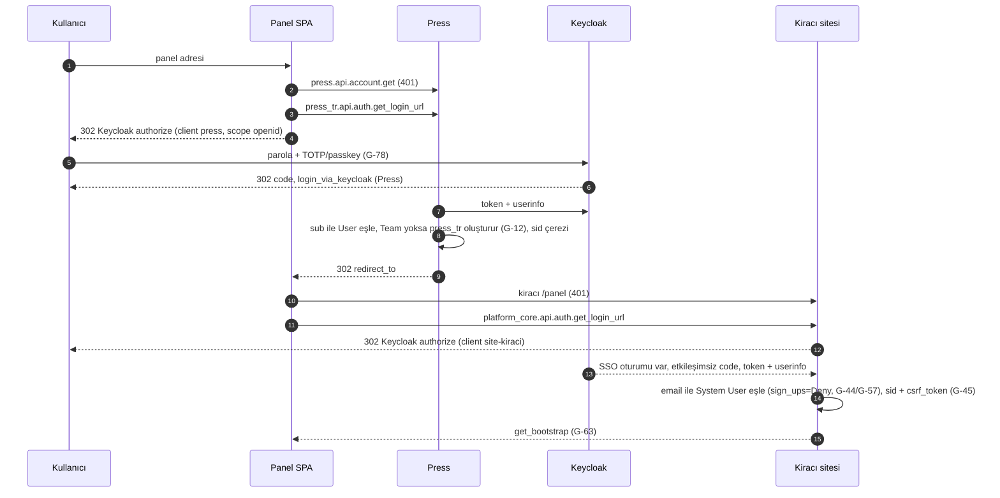
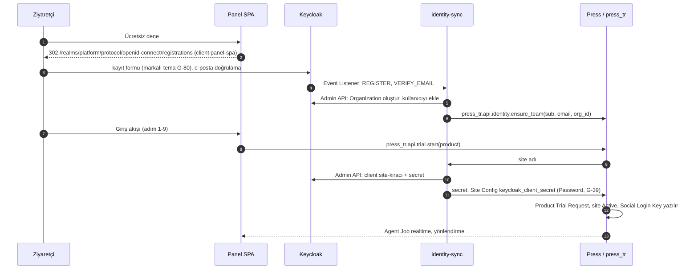
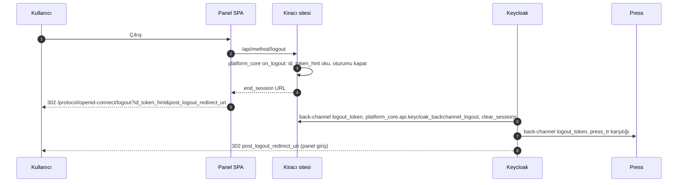

Keycloak; panel, Press, operasyon sitesi ve tüm kiracı siteleri için tek kimlik sağlayıcısıdır: kimlik doğrulama, MFA, e-posta doğrulama ve Organization üyeliğini taşır. Yetkinin doğruluk kaynağı uygulama tarafıdır (Press Role, Frappe Role Profile, Access Rule; X-10). Bu ray G-76..G-82'yi uygular ve G-12, G-16, G-28, G-44, G-57, G-58, G-59'daki Frappe karşılıklarına bağlanır; operatör kimliği SA-1..SA-3'te tanımlanır.

## 1. Kimlik modeli (G-77)

| Nesne | Keycloak karşılığı | Eşlendiği kayıt |
| --- | --- | --- |
| Realm | `platform` (prod), `platform-staging` (X-02) | — |
| Müşteri takımı | Organization (alan adı, üyelik, davet) | Press Team `keycloak_org_id` Custom Field (press\_tr) |
| Kullanıcı | User; kimlik anahtarı `sub`, eşleme anahtarı `email` | Press User + Team üyesi; kiracı sitede System User (G-57) |
| Operatör (sahibin personeli) | `platform-operator` grubu; realm rolleri `ops-admin`, `ops-billing`, `ops-support`, `ops-finance` | Press System User + Press Ops Billing / Support Agent rolleri; operasyon sitesi rolleri (SA-1, SA-2, SA-3) |
| Panel | `panel-spa` (public, PKCE; redirect `panel.<marka>.com.tr`, `*.<marka>.com.tr/panel`) | — |
| Press | `press` (confidential) | Press Social Login Key provider 'Keycloak' (G-12) |
| Kiracı sitesi | `site-<kiracı>` (confidential; identity-sync Admin API ile açar) | Frappe Social Login Key, redirect `/api/method/frappe.integrations.oauth2_logins.login_via_keycloak` (G-44) |
| Operasyon sitesi | `site-ops` (confidential) | Frappe Social Login Key; yalnız `platform-operator` grubu girer (SA-3) |
| Servisler | `agent-service`, `identity-sync`, `hocuspocus` (service account / JWT doğrulama) | Press OAuth Client + platform\_core `auth_hooks` (G-28, G-59); Hocuspocus `onAuthenticate` (SA-29) |

Her iki Social Login Key'de `user_id_property='sub'` yazılır; Frappe v16 varsayılanı `preferred_username`'dir (doğrulandı: `social_login_key.py` providers\['Keycloak'\]). Frappe'nin OAuth ile kendiliğinden açtığı kullanıcı 'Website User' tipindedir ve eşleme e-posta ile yapılır (doğrulandı: `frappe/utils/oauth.py` `login_oauth_user`); bu yüzden kiracı sitede `sign_ups='Deny'` + ön provizyon (bölüm 4), Press'te `sign_ups='Allow'` + press\_tr on\_login kancasıyla Team oluşturma geçerlidir. Hedef sürüm Keycloak 26.x (son sürüm 26.8.0, 2026-10-01; doğrulandı); Organizations 26.0'dan beri tam destekli, standart token exchange 26.2'den beri iç istemciler arasında destekli (doğrulandı: release notes).

## 2. Akışlar

`get_oauth2_authorize_url` whitelisted değildir (doğrulandı); SPA authorize URL'sini `press_tr.api.auth.get_login_url(redirect_to)` ve `platform_core.api.auth.get_login_url` sarmalayıcılarından alır, state sunucuda üretilir.

**Giriş — tek SSO oturumu, panel → Press → kiracı sitesi**

**Kayıt — yalnızca deneme akışı (G-79, G-31)**

**Çıkış — RP-initiated + back-channel (G-58)**

## 3. Belirteç doğrulama stratejisi

| Çağıran → Hedef | Belirteç | Doğrulayan | Denetlenen |
| --- | --- | --- | --- |
| SPA → kiracı site / Press | Frappe `sid` çerezi (Secure, SameSite=Lax) + `X-Frappe-CSRF-Token` | Frappe oturum katmanı | same-site origin, `allow_cors` (G-13, G-45) |
| Agent → kiracı site | Keycloak access token (RS256, 5 dk), standart token exchange ile | platform\_core `auth_hooks` (G-59) | realm JWKS, `iss`, `aud=site-<kiracı>`, `azp=agent-service`, `exp`, `organization`; e-posta → `frappe.set_user` |
| Agent → Press | Press OAuth Bearer Token (authorization code + PKCE) | Frappe `validate_oauth` (G-28) | Press OAuth Client, kullanıcıya bağlı, kısa ömür |
| Keycloak → site/Press | `logout_token` | platform\_core / press\_tr (G-58) | JWKS, `events`, `sid`/`sub` |
| identity-sync → Press/platform\_core | client credentials JWT | press\_tr / platform\_core `auth_hooks` | `azp=identity-sync`, IP allowlist (G-81) |
| Servisler → Keycloak Admin/Token API | client credentials | Keycloak | service account rolleri `manage-users`, `manage-clients`, `view-organizations` (G-82) |
| Operatör BFF → Press | operatör başına Press API key/secret + `X-Press-Team` | Press | Keycloak operatör rolü → Press hesabı eşlemesi; her çağrı Operator Audit'te (SA-1, SA-25) |
| Tarayıcı → Hocuspocus | Keycloak access token (destek odası) | Hocuspocus `onAuthenticate` → platform\_core Support Session doğrulaması | `sub`, oda kimliği, aktif Support Session (SA-29) |

JWKS 10 dakika önbelleklenir ve bilinmeyen `kid` görülünce yenilenir; saat toleransı 30 sn; tüm servis belirteçleri kısa ömürlü ve audience kısıtlıdır (G-82).

## 4. Provizyon — identity-sync (G-81)

- Kaynak: Keycloak Event Listener SPI (webhook eklentisi; eklenti seçimi doğrulanacak) + saatlik admin event polling yedeği; olaylar REGISTER, VERIFY\_EMAIL, UPDATE\_EMAIL, DELETE\_ACCOUNT, admin USER create/update/delete, `ORGANIZATION_MEMBERSHIP` (doğrulanacak).
- Hedefler: `press_tr.api.identity.*` (Team/üyelik, `remove_team_member`), `platform_core.api.identity.provision` (System User, `role_profiles`, `enabled`), Admin API ile `site-<kiracı>` client yaşam döngüsü ve secret'ın Site Config'e Password olarak yazımı (G-39, G-112).
- E-posta değişikliği yalnızca identity-sync üzerinden `rename_doc('User')` ile uygulanır; Keycloak self-service e-posta alanı kapalıdır (G-57). Silme/devre dışı → tüm sitelerde `User.enabled=0` + Press üyeliği kaldırma (X-11).
- Idempotent, yeniden denemeli, ölü-mektup kuyruğu, gece mutabakatı (Keycloak ↔ Press ↔ kiracı kullanıcı farkı raporu).
- Davet: `press_tr.api.team.invite` → Admin API kullanıcı/Organization üyeliği + `execute-actions-email` (UPDATE\_PASSWORD, CONFIGURE\_TOTP) + Press Team üyeliği + kiracı provizyonu (G-16, G-79).
- MFA işareti: identity-sync, Press Role `admin_access`/`allow_billing` ve Frappe 'Tenant Admin' atamalarını kullanıcı özniteliği `mfa_required=true` olarak yazar; tarayıcı akışında "Condition - User Attribute" ile koşullu OTP/WebAuthn alt akışı (doğrulanacak). Operatör grubunda MFA her zaman zorunludur (SA-1).

## 5. Rol eşlemesi (X-10)

| Katman | Doğruluk kaynağı | Keycloak'tan taşınan |
| --- | --- | --- |
| Kimlik, MFA, oturum, Organization üyeliği | Keycloak | `sub`, `email`, `email_verified`, `organization` |
| Abonelik/fatura/site yetkisi | Press Role bayrakları (G-16) | yalnızca Team eşlemesi |
| Veri yetkisi | Frappe Role Profile + Access Rule + permlevel (G-60..G-62) | yalnızca kullanıcı kimliği |
| Sidebar ve MCP araç listesi | kiracı `has_permission` (G-94, G-85) | — |
| Operatör modu | Keycloak `ops-*` realm rolleri → Press hesabı + operasyon sitesi rolleri (SA-1) | `ops-*` rolleri (yalnız `platform-operator` grubu) |

Realm rolleri yalnızca servis hesapları ve `platform-operator` grubu için tanımlanır; iş rolleri Press ve kiracı sitede yaşar.

## 6. Press SSO (G-12)

Social Login Key: provider 'Keycloak', `custom_base_url=1`, `base_url=https://id.<marka>.com.tr/realms/platform`, `/protocol/openid-connect/{auth,token,userinfo}`, `auth_url_data {response_type: code, scope: openid}`, `sign_ups='Allow'`, `user_id_property='sub'`. press\_tr `before_request`: `press.api.account.signup/send_otp/verify_otp/send_login_link/login_using_key/reset_password/enable_2fa/verify_2fa` ve `product_trial.send_verification_code_for_login` → 403; `/login`, `/signup`, `/dashboard/login` → panel. MFA Keycloak'ta, Press User 2FA zorunluluğu kapalı (G-78). Agent delegasyonu Press OAuth Client ile (G-28).

## 7. Realm politikaları (G-43, G-78, G-80)

Login with email, Verify email Required, brute force detection (5 deneme / 300 sn), parola ≥12 + geçmiş + yaygın parola listesi, TOTP + WebAuthn/passkey, SSO Session Idle 30 dk / Max 12 saat (Frappe `session_expiry` ile hizalı), access token 5 dk, refresh token rotation, Remember me kapalı. Tema: Keycloakify ile `@platform/design-tokens`'tan türetilir, Türkçe birinci dil, 320 px kabul, Playwright E2E (X-16).

## 8. HA kurulum ve sahipler (G-76)

| İş | Sahip |
| --- | --- |
| 2 Keycloak düğümü (26.x, Docker Engine), Infinispan küme, PostgreSQL streaming replika (sürüm Keycloak uyumluluk matrisinden, doğrulanacak), nginx TLS, admin konsolu yalnızca Tailscale/özel ağ | Hüseyin Cengiz |
| `id.<marka>.com.tr` A/AAAA kaydı: değerleri Hüseyin Cengiz hazırlar; apex GoDaddy'de kaldığı sürece Asistan Hüseyin uygular, Route 53'e taşınırsa Hüseyin Cengiz | Hüseyin Cengiz / Asistan Hüseyin |
| Günlük şifreli PostgreSQL yedeği (fsn1 → nbg1), haftalık realm export, RPO ≤ 1 saat (WAL), çeyreklik geri yükleme tatbikatı (G-114) | Hüseyin Cengiz |
| Login/admin event'leri Log Server'a (KVKK/5651 saklama, G-117), metrikler Monitor Server'a (X-05) | Hüseyin Cengiz |
| identity-sync konteyneri, sırlar age/sops (G-112) | Hüseyin Cengiz |
| Realm/client/Organization tanımları realm JSON + identity-sync kodunda sürümlü | platform ekibi |

**Kabul (P0/P1):** Keycloak ile Press'e giriş (P0); test kiracısında etkileşimsiz SSO; panel çıkışı sonrası Keycloak account console'da oturum yok; 'Sign out all sessions' sonrası Frappe 60 sn içinde 401; davet edilen kullanıcı tek hesapla panel, Press ve kiracı sitede oturum açar; e-posta değişikliği yalnızca identity-sync yoluyla; bir Keycloak düğümü kapatıldığında giriş kesintisiz.
