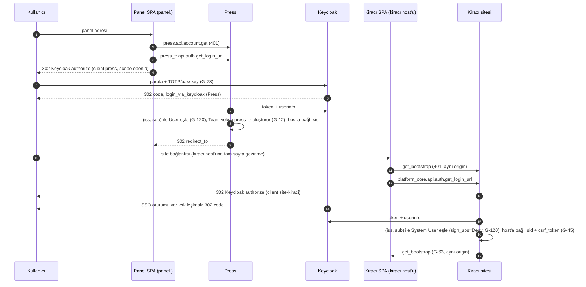
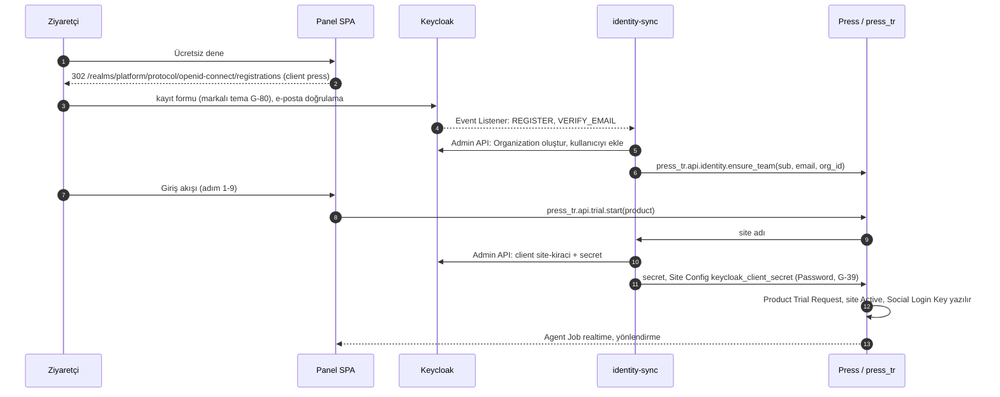
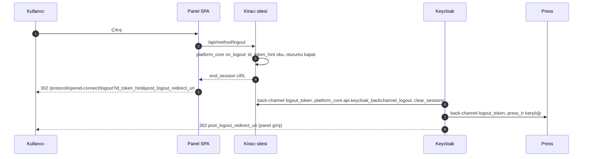

Keycloak; panel, Press, operasyon sitesi ve tüm kiracı siteleri için tek kimlik sağlayıcısıdır: kimlik doğrulama, MFA, e-posta doğrulama ve Organization üyeliğini taşır. Yetkinin doğruluk kaynağı uygulama tarafıdır (Press Role, Frappe Role Profile, Access Rule; X-10). Bu ray G-76..G-82'yi uygular ve G-12, G-16, G-28, G-44, G-57, G-58, G-59'daki Frappe karşılıklarına bağlanır; operatör kimliği SA-1..SA-3'te tanımlanır.

## 1. Kimlik modeli (G-77)

| Nesne | Keycloak karşılığı | Eşlendiği kayıt |
| --- | --- | --- |
| Realm | `platform` (prod), `platform-staging` (X-02) | — |
| Müşteri takımı | Organization (alan adı, üyelik, davet) | Press Team `keycloak_org_id` Custom Field (press\_tr) |
| Kullanıcı | User; kalıcı anahtar `(iss, sub)` (G-120), e-posta yalnız iletişim özniteliği | Press User + Team üyesi; kiracı sitede System User (G-57) |
| Operatör (sahibin personeli) | `platform-operator` grubu; realm rolleri `ops-admin`, `ops-billing`, `ops-support`, `ops-finance` | Press System User + Press Ops Billing / Support Agent rolleri; operasyon sitesi rolleri (SA-1, SA-2, SA-3) |
| Panel | Ayrı istemci yok (K-25): panel host'u Press sitesidir ve `press` istemcisiyle oturum açar; tarayıcıya belirteç verilmez | — |
| Press | `press` (confidential) | Press Social Login Key provider 'Keycloak' (G-12) |
| Kiracı sitesi | `site-<kiracı>` (confidential) ve kiracının audience kapsamı (Audience mapper; `identity-sync`, `press-service` ve `ops-bff`'ye yalnız varsayılan olmayan kapsam olarak bağlı); ikisini identity-sync Admin API ile açar | Frappe Social Login Key, redirect `/api/method/frappe.integrations.oauth2_logins.login_via_keycloak` (G-44) |
| Operasyon sitesi | `site-ops` (confidential) ve audience kapsamı (yalnız `ops-bff`'ye, varsayılan olmayan) | Frappe Social Login Key; yalnız `platform-operator` grubu girer (SA-3) |
| Servisler | `agent-service`, `identity-sync`, `press-service` (service account) | Press OAuth Client + platform\_core `auth_hooks` (G-28, G-59); Hocuspocus Keycloak istemcisi kullanmaz, site biletini doğrular (SA-29, G-148) |
| Operatör BFF'i | `ops-bff` (confidential; servis hesabı yok; standart akış + PKCE ve standart token exchange açık; dönüş ve back-channel logout adresleri yalnız `operator.` üzerinde tam adres) | Operatör başına Press API key (SA-1); hedef sitenin `auth_hooks`'u (G-59) |

Her iki Social Login Key'de `user_id_property='sub'` yazılır; Frappe v16 varsayılanı `preferred_username`'dir (doğrulandı: `social_login_key.py` providers\['Keycloak'\]). Frappe'nin OAuth ile kendiliğinden açtığı kullanıcı 'Website User' tipindedir ve eşleme e-posta ile yapılır (doğrulandı: `frappe/utils/oauth.py` `login_oauth_user`); bu yüzden kiracı sitede `sign_ups='Deny'` + ön provizyon (bölüm 4), Press'te `sign_ups='Allow'` + press\_tr on\_login kancasıyla Team oluşturma geçerlidir. Kalıcı eşleme giriş kancasında `(iss, sub)` ile yapılır; e-posta değişimi kimliği değiştirmez, aynı e-postayla yeniden açılan hesap eski kayda bağlanmaz (G-120). Hedef sürüm Keycloak 26.x (son sürüm 26.8.0, 2026-10-01; doğrulandı); Organizations 26.0'dan beri tam destekli, standart token exchange 26.2'den beri iç istemciler arasında destekli (doğrulandı: release notes).

## Origin ve oturum sözleşmesi (G-119)

Tek Keycloak SSO oturumu her siteye etkileşimsiz OIDC dönüşüyle ayrı bir site oturumu açtırır; ortak parent-domain `sid` yoktur. Bu tablo tasarım sözleşmesidir; uygulanmadı ve test edilmedi.

| Host | Sunan | Oturum | CSRF kaynağı | CORS | Realtime / WS kimliği |
| --- | --- | --- | --- | --- | --- |
| `panel.<marka>.com.tr` | Press sitesi (press\_tr www, SPA) | Host'a bağlı `sid` | www sayfası | Yok (aynı origin) | Press socket.io, aynı origin |
| `operator.<marka>.com.tr` | Aynı SPA'nın operatör modu ve operatör BFF'i (`ops-bff`), ters vekil arkasında aynı origin; yalnız Tailscale/özel ağ (`press.` ile aynı sınır, Press Desk'ten ayrı origin); satıcı betiği yok (G-134) | BFF'in host'a bağlı HttpOnly sunucu oturumu; Keycloak belirteçleri yalnız bu oturumda (G-148); dönüş ve back-channel logout adresi bu origin'de (G-58) | BFF oturumuna bağlı CSRF belirteci | Yok (aynı origin); tarayıcı `ops.` host'una istek atmaz (K-16) | Operatör bileti: `ops-bff` kiracı sitesinden alır; Hocuspocus yalnız bu origin'den kabul eder |
| `press.<marka>.com.tr` | Press Desk (operatör; yalnız Tailscale) | Ayrı `sid` | Desk | Yok | Desk |
| `<kiracı>.app.<marka>.com.tr` | Kiracı sitesi (platform\_core www, SPA) | Host'a bağlı `sid` | `www/<panel>.py` | Yok | Kiracı socket.io, aynı origin |
| Doğrulanmış özel alan adı | Aynı kiracı sitesi; kiracının kayıtlı origin'i (G-119) | O host'a bağlı `sid` | Aynı | Yok | Aynı origin; redirect URI tam adres (G-124) |
| `ops.<marka>.com.tr` | Operasyon sitesi (personel Desk); operatör modu buraya yalnız `ops-bff` üzerinden erişir | Host'a bağlı `sid` | Desk / www | Yok | — |
| `agent.` ve Hocuspocus | Agent servisi, Hocuspocus | Çerez yok; aracı belirteci / tek kullanımlık bilet (G-148) | Gerekmez | Aracı belirteci ve müşteri bileti yalnız basan kiracının kayıtlı origin'lerinden (kiracı host'u ve doğrulanmış özel alan adları, G-119), operatör bileti yalnız `operator.` origin'inden (`ops.` listede yok); kimlik bilgisiz | Bilet + aktif Support Session |
| `id.<marka>.com.tr` | Keycloak | Yalnız Keycloak SSO oturumu | Keycloak | Yok | — |

## 2. Akışlar

`get_oauth2_authorize_url` whitelisted değildir (doğrulandı); SPA authorize URL'sini `press_tr.api.auth.get_login_url(redirect_to)` ve `platform_core.api.auth.get_login_url` sarmalayıcılarından alır, state sunucuda üretilir.

**Giriş — tek SSO oturumu, host'a bağlı site oturumları**

**Kayıt — yalnızca deneme akışı (G-79, G-31)**

**Çıkış — RP-initiated + back-channel (G-58)**

## 3. Belirteç doğrulama stratejisi

| Çağıran → Hedef | Belirteç | Doğrulayan | Denetlenen |
| --- | --- | --- | --- |
| SPA → kiracı site / Press | Host'a bağlı Frappe `sid` (Secure, HttpOnly, SameSite=Lax) + `X-Frappe-CSRF-Token` | Frappe oturum katmanı | aynı origin; CORS yok (G-119, G-45) |
| Agent → kiracı site | Kiracı sitesinin oturumdan bastığı kısa ömürlü aracı belirteci (G-148, K-25) | platform\_core `auth_hooks` (G-59) | imza, `aud` (agent + site), `exp` (dakikalar), `jti` tek kullanım ve iptal, kapsam; kullanıcı `(iss, sub)` ile |
| Agent → Press | Press OAuth Bearer Token (authorization code + PKCE) | Frappe `validate_oauth` (G-28) | Press OAuth Client, kullanıcıya bağlı, kısa ömür |
| Keycloak → site/Press/`ops-bff` | `logout_token` | platform\_core / press\_tr / `ops-bff` (G-58) | JWKS, `events`, `sid`/`sub`; `ops-bff`'de `logout_token` ya da yenileme hatası BFF oturumunu ve elindeki Keycloak ve değiştirilmiş belirteçleri hemen düşürür, Press anahtarı o oturumda kullanılmaz; çıkıştan 60 sn içinde BFF çağrısı 401. Keycloak düğümleri `operator.` back-channel logout yoluna Tailscale üzerinden erişir: Tailscale ACL Keycloak düğümlerinden yalnız `operator.` HTTPS servisine (443) izin verir, yol kısıtı (yalnız back-channel logout) ters vekil/BFF yol izin listesindedir (ağ sahibi Hüseyin Cengiz; staging kabulünde sınanır, sunucu değişikliği bu belgeyle yapılmaz) |
| identity-sync → Press/platform\_core | client credentials JWT; kiracıya giden belirteçte `scope` ile yalnız o kiracının audience kapsamı (G-82) | press\_tr / platform\_core `auth_hooks` (G-59) | `azp=identity-sync`, `aud` yalnız hedefin istemcisi (`press` ya da `site-<kiracı>`; ikisi de `scope` ile istenen varsayılan olmayan kapsamdan), IP allowlist (G-81) |
| Servisler → Keycloak Admin/Token API | client credentials | Keycloak | service account rolleri `manage-users`, `manage-clients`, `view-organizations`; bu roller yalnız Admin API için alınan ayrı belirteçte (G-82) |
| Operatör → `ops-bff` (giriş) | Authorization code + PKCE (S256); Keycloak SSO oturumu varsa etkileşimsiz; dönüş adresi `operator.` üzerinde | `ops-bff` (kod sunucuda değişir) | `platform-operator` grubu ve MFA (SA-1); erişim ve yenileme belirteci yalnız BFF sunucu oturumunda tutulur ve orada yenilenir (G-78, G-148); tarayıcıda yalnız HttpOnly oturum + CSRF (G-119); çıkış G-58 |
| Operatör BFF'i (`ops-bff`) → Press | operatör başına Press API key/secret + `X-Press-Team` | Press | Keycloak operatör rolü → Press hesabı eşlemesi; her çağrı Operator Audit'te (SA-1, SA-25) |
| Operatör BFF'i (`ops-bff`) → operasyon sitesi (Müşteri 360 okuması) | Operatörün belirteci çağrı başına standart token exchange V2 ile yalnız `site-ops` audience'lı kısa ömürlü belirtece çevrilir | platform\_core `auth_hooks` (G-59) | `azp=ops-bff`, `aud` yalnız `site-ops`; `(iss, sub)` ile operasyon sitesi kullanıcısı ve rolleri (G-120, SA-3, SA-24) |
| Press → kiracı site (Support Session aç/kapat) | `press-service` client credentials JWT; `scope` ile yalnız o kiracının audience kapsamı (G-82) | platform\_core `auth_hooks` (G-59) | `azp=press-service`, `aud` yalnız bu site, kapsam yalnız Support Session yaşam döngüsü, `exp` |
| Operatör BFF'i (`ops-bff`) → kiracı site (destek bileti, Support Session içinde salt okur görünüm) | Aynı mekanizmayla yalnız `site-<kiracı>` audience'lı kısa ömürlü belirteç (`sub` = operatör) | platform\_core `auth_hooks` (G-59) | `azp=ops-bff`, `aud` yalnız bu site, `(iss, sub)` aktif ve rızalı Support Session'daki operatör, kapsam, `exp`; oturum yoksa ret; kiracı API oturumu açılmaz, ekran durumu Hocuspocus odasından gelir (SA-43) |
| Tarayıcı → Hocuspocus | Kiracı sitesinin bastığı tek kullanımlık bilet (G-148): müşteri kendi site oturumuyla, operatör `ops-bff` üzerinden alır | Hocuspocus `onAuthenticate` → platform\_core | bilet, oda, aktif Support Session ve kapsam; Origin bilet türüne bağlı (müşteri: basan kiracının kayıtlı origin'leri; operatör: yalnız `operator.`); iptalde bağlantı sunucudan kapanır (SA-42) |

Servis JWT'leri için JWKS 10 dakika önbelleklenir ve bilinmeyen `kid` görülünce yenilenir; saat toleransı 30 sn; tüm servis belirteçleri kısa ömürlü ve audience kısıtlıdır (G-82).

**Audience daraltma (doğrulandı: Keycloak 26.8.0, 2026-10-08).** Kiracının ve operasyon sitesinin audience'ı, Audience mapper'lı varsayılan olmayan kapsam `scope` ile istenmedikçe belirtece girmez; bu istemcilerde istemci rolü tanımlanmadığı için Audience Resolve da eklemez ([audience](https://www.keycloak.org/docs/26.8.0/server_admin/index.html#_audience_hardcoded)); client credentials isteği de `scope`'u uygular ([kod](https://github.com/keycloak/keycloak/blob/4246609cf2024c85016d3fb1254c3d2533367c31/services/src/main/java/org/keycloak/protocol/oidc/grants/ClientCredentialsGrantType.java#L105-L132)). Standart token exchange V2 yalnız confidential ve bu özelliği açık istemciye açıktır; istekte bulunan istemci subject token'ın `aud` değerinde olmalıdır, kendi belirtecini değiştiren istemci bundan muaftır; `audience` parametresi yalnız süzer, ekleme `scope` ile yapılır; değiştirilen erişim belirteci subject token iptal edilince iptal olmaz ([token exchange](https://www.keycloak.org/securing-apps/token-exchange#_standard-token-exchange-details)). `ops-bff` operatörün kendi belirtecini değiştirir; `scope` (hedefin kapsamı) ve `audience` (hedefin istemcisi) birlikte verilir, sonuçta `aud` tek değerdir. Servis belirteci tek `aud` taşır: servis hesabına kendi işi dışında istemci rolü atanmaz, `identity-sync`'in Admin API rolleri yalnız Admin API için istenen ayrı kapsamdadır ve kiracıya giden belirtece girmez; varsayılan kapsamlarda audience eşleyicisi yoktur; `identity-sync`'in Press'e giden belirtecindeki `press` audience'ı da `scope` ile istenen varsayılan olmayan kapsamdandır. Başka audience taşıyan belirteci site reddeder (G-59); staging kabulünde her servis belirtecinde `aud` tek değerdir (G-82, SA-40). Kiracı sayısıyla büyüyen kapsam listesinin belirteç üretim süresine etkisi staging'de ölçülür (doğrulanacak).

## 4. Provizyon — identity-sync (G-81)

- Kaynak: Keycloak Event Listener SPI (webhook eklentisi; eklenti seçimi doğrulanacak) + saatlik admin event polling yedeği; olaylar REGISTER, VERIFY\_EMAIL, UPDATE\_EMAIL, DELETE\_ACCOUNT, admin USER create/update/delete, `ORGANIZATION_MEMBERSHIP` (doğrulanacak).
- Hedefler: `press_tr.api.identity.*` (Team/üyelik, `remove_team_member`), `platform_core.api.identity.provision` (System User, `role_profiles`, `enabled`), Admin API ile `site-<kiracı>` client yaşam döngüsü ve secret'ın Site Config'e Password olarak yazımı (G-39, G-112).
- E-posta değişikliği yalnızca identity-sync üzerinden `rename_doc('User')` ile uygulanır; Keycloak self-service e-posta alanı kapalıdır (G-57). Silme/devre dışı → tüm sitelerde `User.enabled=0` + Press üyeliği kaldırma (X-11).
- Idempotent, yeniden denemeli, ölü-mektup kuyruğu, gece mutabakatı (Keycloak ↔ Press ↔ kiracı kullanıcı farkı raporu).
- Davet: `press_tr.api.team.invite` → Admin API kullanıcı/Organization üyeliği + `execute-actions-email` (UPDATE\_PASSWORD, CONFIGURE\_TOTP) + Press Team üyeliği + kiracı provizyonu (G-16, G-79).
- MFA işareti: identity-sync, Press Role `admin_access`/`allow_billing` ve Frappe 'Tenant Admin' atamalarını kullanıcı özniteliği `mfa_required=true` olarak yazar; tarayıcı akışında "Condition - User Attribute" ile koşullu OTP/WebAuthn alt akışı (doğrulanacak). Operatör grubunda MFA her zaman zorunludur (SA-1).

## 5. Rol eşlemesi (X-10)

| Katman | Doğruluk kaynağı | Keycloak'tan taşınan |
| --- | --- | --- |
| Kimlik, MFA, oturum, Organization üyeliği | Keycloak | `sub`, `email`, `email_verified`, `organization` |
| Abonelik/fatura/site yetkisi | Press Role bayrakları (G-16) | yalnızca Team eşlemesi |
| Veri yetkisi | Frappe Role Profile + Access Rule + permlevel (G-60..G-62) | yalnızca kullanıcı kimliği |
| Sidebar ve MCP araç listesi | kiracı `has_permission` (G-94, G-85) | — |
| Operatör modu | Keycloak `ops-*` realm rolleri → Press hesabı + operasyon sitesi rolleri (SA-1) | `ops-*` rolleri (yalnız `platform-operator` grubu) |

Realm rolleri yalnızca servis hesapları ve `platform-operator` grubu için tanımlanır; iş rolleri Press ve kiracı sitede yaşar.

## 6. Press SSO (G-12)

Social Login Key: provider 'Keycloak', `custom_base_url=1`, `base_url=https://id.<marka>.com.tr/realms/platform`, `/protocol/openid-connect/{auth,token,userinfo}`, `auth_url_data {response_type: code, scope: openid}`, `sign_ups='Allow'`, `user_id_property='sub'`. press\_tr `before_request`: `press.api.account.signup/send_otp/verify_otp/send_login_link/login_using_key/reset_password/enable_2fa/verify_2fa` ve `product_trial.send_verification_code_for_login` → 403; `/login`, `/signup`, `/dashboard/login` → panel. MFA Keycloak'ta, Press User 2FA zorunluluğu kapalı (G-78). Agent delegasyonu Press OAuth Client ile (G-28).

## 7. Realm politikaları (G-43, G-78, G-80)

Sertleştirme (G-144): yönetim konsolu ve Admin REST API public host'ta reverse proxy'de kapalı (ayrı `hostname-admin` tek başına yetmez; doğrulandı: Keycloak hostname rehberi), anonim dinamik istemci kaydı kapalı, redirect URI'leri tam adres, kullanılmayan özellikler (JWT Authorization Grant, stateless mod) kapalı, her minor sürüm Upgrading Guide ile staging'de. Politikalar: Login with email, Verify email Required, brute force detection (5 deneme / 300 sn), parola ≥12 + geçmiş + yaygın parola listesi, TOTP + WebAuthn/passkey, SSO Session Idle 30 dk / Max 12 saat (Frappe `session_expiry` ile hizalı), access token 5 dk, refresh token rotation, Remember me kapalı. Tema: Keycloakify ile `@platform/design-tokens`'tan türetilir, Türkçe birinci dil, 320 px kabul, Playwright E2E (X-16).

## 8. HA kurulum ve sahipler (G-76)

| İş | Sahip |
| --- | --- |
| 2 Keycloak düğümü (26.x, Docker Engine), Infinispan küme, PostgreSQL streaming replika (sürüm Keycloak uyumluluk matrisinden, doğrulanacak), nginx TLS, admin konsolu yalnızca Tailscale/özel ağ | Hüseyin Cengiz |
| `id.<marka>.com.tr` A/AAAA kaydı: değerleri Hüseyin Cengiz hazırlar; apex GoDaddy'de kaldığı sürece Asistan Hüseyin uygular, Route 53'e taşınırsa Hüseyin Cengiz | Hüseyin Cengiz / Asistan Hüseyin |
| Günlük şifreli PostgreSQL yedeği (fsn1 → nbg1), haftalık realm export, RPO ≤ 1 saat (WAL), çeyreklik geri yükleme tatbikatı (G-114) | Hüseyin Cengiz |
| Login/admin event'leri Log Server'a (KVKK/5651 saklama, G-117), metrikler Monitor Server'a (X-05) | Hüseyin Cengiz |
| identity-sync konteyneri, sırlar age/sops (G-112) | Hüseyin Cengiz |
| Realm/client/Organization tanımları realm JSON + identity-sync kodunda sürümlü | platform ekibi |

**Kabul (P0/P1/P2):** Keycloak HA ve public host'ta yönetim uçlarının kapalı olması (P0); Keycloak ile Press'e giriş ve `(iss, sub)` eşleme testleri (P1); özel alan adında giriş-çıkış (P2, G-124); test kiracısında etkileşimsiz SSO; panel çıkışı sonrası Keycloak account console'da oturum yok; 'Sign out all sessions' sonrası Frappe 60 sn içinde 401; davet edilen kullanıcı tek hesapla panel, Press ve kiracı sitede oturum açar; e-posta değişikliği yalnızca identity-sync yoluyla; bir Keycloak düğümü kapatıldığında giriş kesintisiz.
