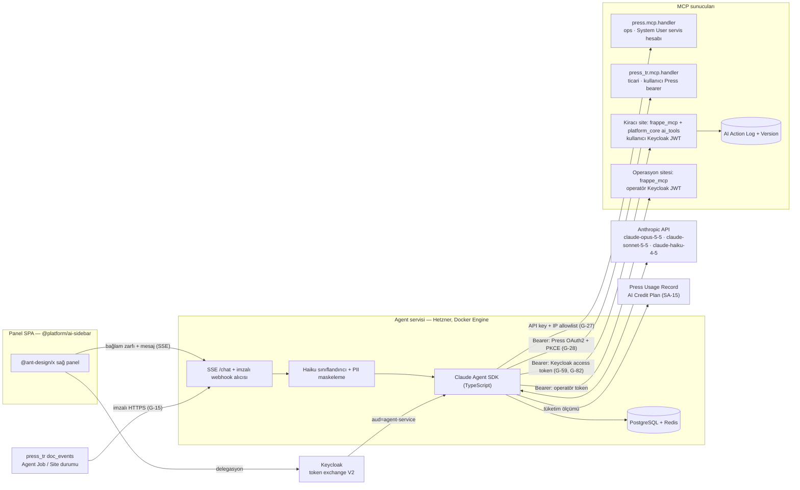

Bu ray P3 fazında teslim edilen agent servisini, MCP kaynaklarını, niyet protokolünü, @ant-design/x sağ paneli ve güvenlik/KVKK katmanını kapsar (G-83..G-92). Her AI aksiyonu Rail 2'nin yetki motorundan (G-59, G-60, G-61) ve Rail 1'in ticari MCP'sinden (G-27, G-28) geçer; maliyet ve kota bağı X-07, kiracı CPU payı X-13, güvenlik test programı X-14 ile kapanır. AI kredisi ölçümü Press defterine yazılır (SA-15).

## 8.1 MCP topolojisi (G-84)

| MCP sunucusu | Kimlik | Araç sınıfı | Denetim izi |
| --- | --- | --- | --- |
| `press.mcp.handler` (Press Settings.enable\_mcp=1) | System User servis hesabı, IP allowlist | Sunucu/bench/site ops; yalnızca iç ekip ajanı (SA-39) | Agent Job + Site Activity (doğrulandı) |
| `press_tr.mcp.handler` | Kullanıcıya bağlı Press bearer (OAuth Client + PKCE, G-28) | list\_marketplace\_apps, get\_app\_plans, install\_app, change\_app\_plan, change\_site\_plan, get\_invoices, get\_upcoming\_invoice, get\_agent\_job\_status, buy\_credits; confirm bayraklı | Agent Job, Site Activity, Invoice |
| Kiracı `frappe_mcp` + `platform_core.ai_tools` | Keycloak access token → `auth_hooks` adaptörü (G-59) | doc CRUD, rapor çalıştırma, workflow aksiyonu, uygulama araçları (G-105) | Version + AI Action Log (G-64, G-87) |
| Operasyon sitesi `frappe_mcp` | Operatör Keycloak token (`ops-*` rolleri) | müşteri 360 özeti, ticket taslakları, mutabakat raporu okuma (SA-24) | AI Action Log + Operator Audit (SA-26) |

frappe\_mcp'nin Frappe v16 uyumu P3 başında kurulumla teyit edilir (doğrulanacak); uyum sağlanamazsa aynı araç şeması platform\_core içinde Streamable HTTP uç noktası olarak sunulur.

## 8.2 Agent servisi (G-83)

- Claude Agent SDK (TypeScript) üzerinde stateless işçiler; Docker Engine konteyneri, PostgreSQL (konuşma, önizleme, kota sayaçları), Redis (kuyruk, oran sınırı), SSE akış ucu, imzalı webhook alıcısı. Konteyner, DB, TLS ve ağ kuralları: Hüseyin Cengiz. `agent.<marka>.com.tr` A kaydının değerini Hüseyin Cengiz hazırlar; apex bölgesi GoDaddy'de kaldığı sürece Asistan Hüseyin uygular, Hüseyin Cengiz doğrular.
- Model rolleri (model kimlikleri `claude-api` referansıyla doğrulandı, 2026-09-25 önbelleği):

| Rol | Model | Not |
| --- | --- | --- |
| Niyet sınıflandırma, PII tespiti, içe aktarmada sütun→alan önerisi | `claude-haiku-4-5` | 200K bağlam; thinking `budget_tokens` ile |
| Standart aksiyonlar, tek tık akışları | `claude-sonnet-5-5` | adaptive thinking; effort `medium` ile başlanır, eval ile ayarlanır |
| Çok adımlı/riskli aksiyonlar, önizleme üretimi | `claude-opus-5-5` | effort açıkça yazılır (varsayılan `medium`) |

- API sözleşmesi (doğrulandı): Opus 5.5 ve Sonnet 5.5'te `tool_choice: auto` + araçlarda `strict: true`; mesaj geçmişi append-only tutulur (preserved thinking); `stop_reason: "refusal"` ve `fallbacks` işlenir; önbellek için `tools → system → messages` sıralaması sabit, değişken bağlam son breakpoint'ten sonra gelir; operatör talimatları mid-conversation system message kanalıyla verilir.
- Sırlar ortam değişkeni/age ile (G-112); konuşma verisi yalnızca Hetzner'deki PostgreSQL'de (G-90).
- Kredi ölçümü: her tur sonunda token/maliyet, takımın `AI Credit Plan` Usage Record'una System User servis hesabıyla yazılır; tur başlamadan `Team.get_balance` ve `spending_limit` okunur, yetersiz bakiyede ücretli araçlar kilitlenir ve panel 'Kredi yükle' eylemini gösterir (SA-15).

## 8.3 Niyet protokolü (G-86, G-88, G-105)

1. Panel her turda yapılandırılmış bağlam zarfı gönderir: `{site, user, route, doctype, docname, selected_names[], filters, installed_apps[], roles[], locale}`; belge içeriği araç çağrısıyla sunucu tarafında okunur.
2. Haiku sınıflandırıcı mesajı sınıfa atar: `read`, `navigate`, `write`, `destructive`, `billable`, `unknown`; `unknown` ve düşük güven onay zorunlu sınıfa düşer.
3. Araç listesi kullanıcının kurulu uygulamaları, rolleri ve sınıfa göre daraltılır (G-84).
4. `destructive`/`billable` araçlar önce `confirm=false` ile çağrılır; sunucu etkilenen kayıtların diff/özetini, maliyet etkisini ve `preview_hash` (TTL 10 dk) döner.
5. UI Actions ile onay ister; `confirm=true` yalnızca aynı `preview_hash` ile kabul edilir; zincirli yıkıcı aksiyonlar her adımda ayrı onay alır.
6. Sonuç, model, token ve maliyet AI Action Log'a ve ilgili Version kaydına yazılır (G-87).

| Sınıf | Örnek araç | Kapı |
| --- | --- | --- |
| read / navigate | get\_list, get\_doc, run\_report, open\_route | has\_permission + Access Rule |
| write | insert / update (tek kayıt) | yetki + diff önizleme |
| destructive | delete, cancel, submit, bulk\_update, apply\_workflow | önizle + onayla zorunlu |
| billable | install\_app, change\_app\_plan, change\_site\_plan, buy\_credits | önizle + onayla + Press Role allow\_billing/allow\_apps (G-16) |

Uygulamalar `ai_tools` hook'uyla araç şemasını, gereken rolü, `destructive/billable` bayrağını, önizleme üreticisini ve Prompts (tek tık akışları) bildirir (G-105); CronHR ilk örnektir: izin onayı, bordro kontrol özeti (G-108).

## 8.4 @ant-design/x arayüzü (G-88)

| İhtiyaç | Bileşen |
| --- | --- |
| Mesaj akışı, SSE | Bubble.List + XStream / useXAgent |
| Giriş ve ek dosya | Sender, Attachments (Frappe `upload_file`) |
| Konuşma geçmişi | Conversations |
| Tek tık akışları, bağlama göre öneri | Prompts, Suggestion |
| Araç çağrısı adımları | ThoughtChain |
| Önizle / onayla / iptal | Actions |

Bileşen adları kurulu @ant-design/x sürümünde doğrulanır (doğrulanacak). Panel 320 px'te tam ekran Drawer, geniş ekranda sağ sütun; tasarım tokenları ConfigProvider üzerinden (G-67); tek `:focus-visible` göstergesi, ≥1rem metin, tüm aksiyonlar klavyeyle erişilir. Press bildirimleri ve başarısız Agent Job'lar aksiyon alınabilir öğe olarak panele düşer (G-100); plan yükselt / uygulama etkinleştir / kredi yükle aynı önizle+onayla ile (G-27, G-30, SA-6). Playwright matrisi (G-74) AI panelini kapsar.

## 8.5 Yetki eşitliği ve prompt injection (G-85, G-89, X-14)

- Kiracı verisine erişen her araç çağrısı kullanıcının Keycloak token'ıyla Frappe `has_permission`, Access Rule (G-60) ve permlevel (G-61) katmanından geçer; Press aksiyonları kullanıcıya bağlı Press bearer ile yürür.
- Araç sonuçları ve belge içerikleri yapılandırılmış veri bloğu olarak iletilir; operatör talimatı yalnızca system kanalındadır.
- Tur başına üst sınırlar: 12 araç çağrısı, 120 s süre, 16K çıktı token; takım başına Redis oran sınırı ve plan kotası (G-92).
- Şüpheli talimat kalıbında aksiyon durur ve kullanıcıya gösterilir; negatif testler (yetkisiz doctype, kayıt kuralı dışı belge, permlevel alanı, başka takımın sitesi, confirm'siz yıkıcı çağrı) AI Action Log'a `denied` yazar ve CI kırmızı takım eval setinde koşar.

## 8.6 KVKK, denetim, ölçüm ve kota (G-87, G-90, G-91, G-92, X-07)

- Anthropic API aktarımı veri envanterine ve aydınlatma metnine 'AI işleme' alıcısı olarak işlenir; kiracı admin AI özelliğini takım düzeyinde kapatabilir; Anthropic saklama ve eğitim dışı tutma koşulları sözleşmede teyit edilir (doğrulanacak).
- Gönderim öncesi TCKN/VKN/IBAN/kart numaraları Haiku + regex ile maskelenir; maskeleme kuralları golden testlerde yer alır ve Rail 6 ortak maskeleme sözlüğüyle paylaşılır (SA-36).
- Saklama: AI Action Log 365 gün, konuşma içeriği 90 gün (G-52 ile uyumlu); tüm veri Hetzner'de.
- Kota ve kredi: Marketplace App Plan features'ta aylık mesaj/token kotası; aşımı Press `Balance Transaction` defterinden düşen AI kredisiyle karşılanır, ek kredi iyzico ile yüklenir (SA-6, SA-15); agent DB sayaçları kalan kota ve bakiyeyi panele döner; aşımda yumuşak sınır + plan yükseltme önerisi. Birim maliyet X-07 tablosuna girer: Opus 5.5 $4/$20, Sonnet 5.5 $2/$10, Haiku 4.5 $1/$5 per MTok (doğrulandı, claude-api referansı).
- Kalite kapıları (G-91): Türkçe golden konuşma seti, araç seçimi doğruluğu, yanlış yıkıcı aksiyon = 0, yetki ihlali = 0; izler GlitchTip + OpenTelemetry; model/prompt sürümleri kayıtlı; kademeli dağıtım.

## 8.7 P3 teslim sırası ve kabul

| Adım | Çıktı | Sahip |
| --- | --- | --- |
| 1 | Agent konteyneri, PostgreSQL/Redis, TLS, ağ allowlist, DNS kaydı | Hüseyin Cengiz (DNS uygulaması: Asistan Hüseyin) |
| 2 | Press OAuth Client + `press_tr.mcp.handler` (G-27, G-28); Keycloak `agent-service` client + token exchange (G-82) | Platform ekibi |
| 3 | platform\_core `auth_hooks`, `ai_tools` kaydı, AI Action Log (G-59, G-64) | Platform ekibi |
| 4 | Niyet protokolü, `preview_hash`, Haiku sınıflandırıcı, PII maskeleme | Platform ekibi |
| 5 | `@platform/ai-sidebar` paketi + Playwright kapsamı | Frontend ekibi |
| 6 | AI Credit Plan + Usage Record ölçümü, bakiye kilidi (SA-15) | Platform ekibi + AI ekibi |
| 7 | Eval seti, kırmızı takım testleri, KVKK envanter güncellemesi | Platform ekibi + hukuk |

Kabul: panelden en az üç tek tık akışı prod'da çalışır; yıkıcı/ücretli aksiyonlar confirm olmadan yalnızca önizleme döner; her araç çağrısı kullanıcının Frappe/Press yetkisiyle yürütülüp AI Action Log'a düşer; prompt injection ve yetki aşımı negatif testleri geçer; Anthropic aktarımı KVKK envanterine işlenmiştir; AI tüketimi Press Usage Record'da görünür.
