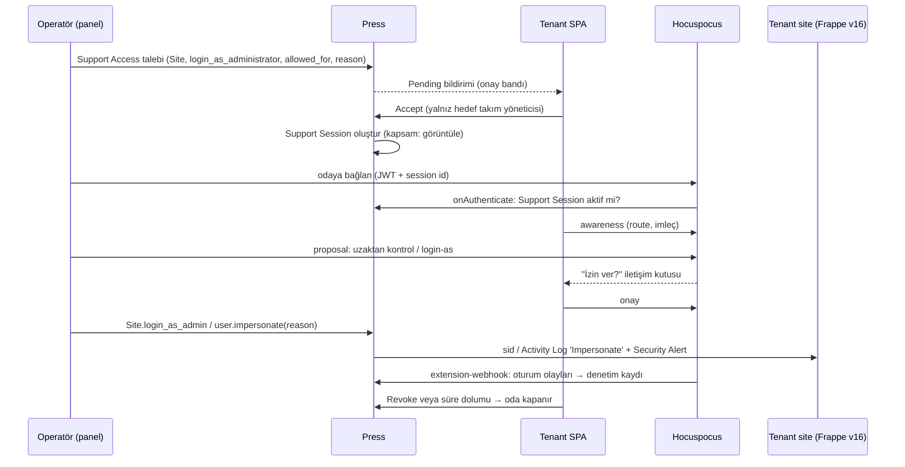

**Karar:** Superadmin paneli olmalıdır; Press (master 7a4384d) plan, abonelik, kullanım ölçümü, fatura, ön ödemeli kredi defteri, modül aboneliği, kart tahsilatı ve rızaya dayalı destek erişimi için **ticari kayıt sistemi** olarak yeter, ancak cari hesap, resmi muhasebe, e-Fatura/e-Arşiv, helpdesk, CRM, TRY/KDV, iyzico ve EFT için hiçbir şey sunmaz; bu işleri Press'in kendisi de dış bir ERPNext'e devreder (`create-fc-invoice`, `delete-fc-team` çağrıları repoda vardır, alıcıları yoktur). İdeal kurulum üç evdir: Press = kontrol düzlemi + faturalama motoru; operasyon sitesi = sahibin kendi ERPNext v16 sitesi (dogfooding) ve muhasebenin tek doğrusu; superadmin paneli = aynı React kabuğunun iki kaynağı birleştiren operatör modu.

## Üç ev: Press · Superadmin paneli · Operasyon sitesi

| İş | Ev | Nasıl |
| --- | --- | --- |
| CRM (lead → fırsat → müşteri) | Operasyon sitesi | Frappe CRM `main` (frappe &gt;=15,&lt;17); `Account Request` → `CRM Lead`, ilk ödeme → `convert_to_deal`; Deal Won → `press.api.ops.create_team` |
| Helpdesk (ticket, SLA, bilgi bankası) | Operasyon sitesi | Frappe Helpdesk `main` (+ `telephony`); `HD Ticket` press\_team/press\_site alanları; tenant widget → agent servisi → `hd_ticket.api.new` eşdeğeri |
| Cari hesap (müşteri kartı, bakiye, ekstre) | Operasyon sitesi | `Customer` (custom\_press\_team, tax\_id, tax\_office) + `Sales Invoice` + `Payment Entry` + GL; `Process Statement Of Accounts` ile aylık ekstre |
| Muhasebeleştirme, KDV, e-Fatura/e-Arşiv | Operasyon sitesi | `create-fc-invoice` alıcısı Sales Invoice üretir; entegratör köprüsü e-belge gönderir; PDF `fetch_invoice_pdf` ile Press'e döner |
| Plan, abonelik, ölçüm, dönemsel fatura | Press | `Site Plan`/`Subscription`/`Usage Record`/`Invoice`; `press_tr` (yeni Press eklenti app'i) ile TRY ve KDV yaması |
| AI kredisi ve ek kredi | Press (+ Agent servisi) | `Balance Transaction` defteri; yükleme `Prepaid Credits` Invoice; tüketim Agent servisinden `Usage Record` (`AI Credit Plan`) |
| Modül satın alma (CronHR, CRM, Webshop) | Press | `Marketplace App Plan` (price\_try) → `Marketplace App Subscription` → site\_config `sk_{app}` + `subscription_update_hook` |
| iyzico kart ödemesi | Press | Stripe/Razorpay deseni: `Iyzico Webhook Log` (guest handler, `X-IYZ-SIGNATURE-V3`), `Iyzico Payment Record`, Checkout Form (tek seferlik) |
| EFT/havale | Operasyon sitesi → Press | `Bank Statement Import` → `Bank Transaction Rule` (referans kodu) → `Payment Entry`; ardından `press.api.ops.record_bank_transfer` |
| Cari işlemler (mutabakat, iade, avans) | Operasyon sitesi + Press | iyzico hak ediş CSV (SFTP) ↔ Payment Entry; iade `press.api.ops.refund_invoice` → negatif BT → `is_return` Sales Invoice |
| Tahsilat/askıya alma (dunning) | Press | `suspend_sites.execute` (\*/30, 14 gün), `Payment Due Extension`; ERPNext `Dunning` yalnız resmi ihtar |
| Müşteri 360 | Superadmin paneli | Salt okur birleştirme: `press.api.client.get/get_list` + `platform_core.api.ops.customer_360(team)` (yeni); yazma sahibi sisteme gider |
| Impersonation (login-as) | Press + tenant sitesi | `Support Access` rızası → `Site.login_as_admin` (Site Activity) veya Frappe v16 `user.impersonate` (Activity Log) |
| Co-browsing / uzaktan yardım | Tenant sitesi + Hocuspocus | Yjs awareness ile imleç/presence/takip; uzaktan kontrol Y.Map `proposal`, müşteri onayı olmadan uygulanmaz |
| Operatör kimliği | Keycloak → Press + ops sitesi | Operatör realm rolleri → Press System User hesapları + ops sitesi rolleri; operatör başına API key |
| Infra ve AI destekli operasyon | Press Desk + Press MCP | `enable_mcp`, System Manager; yalnız ops-admin ve Hüseyin Cengiz |

## Superadmin paneli (operatör modu)

Panel, tenant SPA ile aynı kabuktur; Keycloak operatör realm'inde `ops-admin`, `ops-billing`, `ops-support`, `ops-finance` rolleri kabuğu operatör moduna alır. Ekranlar: **Müşteri 360** (Team, Site'lar, Subscription, Invoice, Balance Transaction, Support Access + Customer, açık Sales Invoice, son Payment Entry, HD Ticket, CRM Deal), **Tahsilat ve kredi** (bakiye, BT ekstresi, kredi tahsisi, bekleyen EFT kuyruğu, iade), **Abonelik ve modüller**, **Destek** (ticket + Support Access + Support Session), **Tahsilat aşaması** (Unpaid → Suspended → Archive scheduled → Archived → Uncollectible), **KVKK denetim raporu**, **Gece mutabakat farkları**.

Press erişimi iki katmanlıdır ve gerekçesi koddur: `press.api.client` `get/set_value/delete/run_doc_method` Support Access'i tanır (client.py L246-260, L336-375), fakat başka takımın Team/Invoice/BT tekil yazması yalnız `frappe.local.system_user()` ile açılır (ownership.py L80-105). Bu yüzden **site düzeyi destek eylemleri** Press Support Agent + Accepted Support Access ile `press.api.client.run_doc_method` üzerinden, **ticari yazmalar** ise System User servis hesabı + `press.api.ops` üzerinden yapılır. Panelin BFF'i operatör başına Press API key/secret ve `X-Press-Team` başlığı kullanır; paylaşımlı anahtar yoktur. `press.api.client.get_list` + `skip_team_filter_for_system_user_and_support_agent` bayrağı Press Support Agent'a Support Access'siz çapraz-kiracı liste okuması verdiği için (client.py L164-170) bu rol KVKK envanterinde ayrıcalıklı sayılır ve her çağrı loglanır. Gerçek zamanlılık: panel verisi TanStack Query ile yenilenir; destek oturumu presence'ı Hocuspocus odasından gelir; ops sitesi `frappe.realtime` kanalı ticket güncellemeleri için kullanılır (doğrulanacak).

## Operasyon sitesi

Press'in sahibin kendi Team'inde ayrı bir Release Group ('ops') ile dağıttığı ERPNext v16.50 sitesidir: `erpnext@version-16`, `crm@main`, `helpdesk@main` (`telephony` zorunlu bağımlılık), platform core ve e-belge entegratör köprüsü. `develop` dalları `whatsapp` ve Python 3.14 ister; v17 geçişi ayrı karardır.

**Veri modeli.** `Team` ↔ `Customer` bire bir; Customer adı `Team.billing_name`'dir çünkü `Team.update_billing_details_on_frappeio` uzak Customer'ı bu adla yeniden adlandırır (team.py L910-937). Customer üzerinde `custom_press_team` (tekil), `tax_id` (VKN/TCKN), `tax_office`, `customer_type`, `custom_efatura_mukellef`; Press tarafında aynı alanlar `press/press/custom/address.json` kalıbıyla eklenir ve `create-fc-invoice` yüküne girer. `HD Customer`, `ERPNext HD Settings.enabled=1` ile Customer'dan otomatik aynalanır; `CRM Organization` `custom_press_team` ile bağlanır. Customer yaratmanın tek sahibi Team olayıdır; `ERPNext CRM Settings.create_customer_on_status_change` kapalıdır.

**Press → Sales Invoice.** `sync_paid_invoices_to_frappeio` (daily\_long) `status=Paid`, `transaction_amount>0`, `frappe_invoice` boş, `Team.enabled=1` faturaları alır; `create_invoice_on_frappeio` gövdeyi **form-encoded** gönderir, `team`/`address`/`invoice` alanları JSON string'dir ve dönen `message` Sales Invoice adıdır (invoice.py L1228-1236). Alıcı `frappe.parse_json` uygular, Press Invoice adına göre idempotent çalışır (`PLAN-/APP-/AI-CREDIT-/SERVICE-` Item eşlemesi), Press API kullanıcısına Sales Invoice read+print verir ve `Press Settings.print_format` adı sitede var olur. İki sonuç bağlayıcıdır: (1) `transaction_amount` yalnız Stripe/Razorpay yollarında dolar ve `options: INR`'dir; iyzico ve EFT yolları bu alanı doldurmadan senkron hiç tetiklenmez; (2) kredi ile kapanan Subscription faturaları `amount_paid==0` olduğundan asla senkronlanmaz; muhasebe kuralı **yükleme = faturalanan olay, tüketim = aylık gelir tahakkuku (Journal Entry), BT bakiyesi = müşteri avansı yükümlülüğü** olarak kurulur ve Finans onayına bağlanır.

**iyzico/EFT → Payment Entry.** iyzico hak edişi `report.iyzipay.com` SFTP CSV'lerinden (`transaction`, `cutoff`, `settlement`) `Iyzico Settlement Line` ara doctype'ına çekilir; ödeme başına komisyon kesintili Payment Entry, payout toplamı Bank Transaction ile eşleşir; anahtar `conversationId` = Press Invoice adı. EFT: banka ekstresi → `Bank Transaction` → `Bank Transaction Rule` ile `custom_payment_reference` (PRS-...) yakalanır → Payment Entry → `Bank Reconciliation Tool`; kesinleşince `press.api.ops.record_bank_transfer` çağrılır.

**e-Fatura konumu.** ERPNext v16 `regional/turkey/setup.py` boş fonksiyondur, `country_wise_tax.json` yalnız eski "VAT 18%" kaydını taşır, UBL-TR üreticisi yoktur; buna karşılık `tr_chart_of_accounts.json` doğrulanmıştır. KDV %20/%10/%1 şablonları elle tanımlanır; e-belge, Sales Invoice submit sonrası entegratör köprüsünden gider (VKN + mükellef → e-Fatura, aksi e-Arşiv; ETTN/durum/XML Sales Invoice'ta). `logedosoft/ERPNext-Turkish-Delight` `TD EInvoice Integrator/Settings` kalıbı (Uyumsoft, Bien Teknoloji) referanstır; v16 uyumu doğrulanmamıştır (doğrulanacak).

**Helpdesk ve CRM akışları.** Tenant widget bağlamı (site, ürün, sürüm, kullanıcı) toplar; agent servisi servis kullanıcısıyla HD Ticket açar (`raised_by` tenant e-postası, Contact ↔ HD Customer Member). SLA plan kademesine göre koşullu `HD Service Level Agreement`, atama ürün bazlı `HD Team` + Assignment Rule. CRM: `Account Request` → `CRM Lead`; `Product Trial Request` 'Site Created' → 'Trial'; ilk Paid Invoice → `convert_to_deal` + Won.

## İzinli destek oturumu

**Yaşam döngüsü.** HD Ticket → operatör Support Access talebi (`resources=[Site]`, `login_as_administrator`, `allowed_for` 3–168 saat, `reason`) → tenant SPA onay bandı (Pending talepler 7 gün sonra `expire_pending_requests` ile düşer; saatlik değil) → Accepted → platform core `Support Session` kaydı (operatör, kapsam, başlangıç/bitiş, rıza sürümü) → bitiş: süre dolumu, müşteri Revoke, operatör Forfeit.

**Rıza ve paylaşılan içerik.** Kapsam kademelidir ve her kademe ayrı onaydır: *görüntüle* (awareness: route, seçim, imleçler; piksel/video yok), *takip et* (operatör görünümü müşteri görünümüne kilitlenir), *login-as* (Press `Site.login_as_admin` → Site Activity 'Login as Administrator'; kullanıcı düzeyi için Frappe v16 `user.impersonate(user, reason)` → Activity Log 'Impersonate' + Notification Log + varsayılan giden Email Account varsa 'Security Alert' e-postası), *uzaktan kontrol* (her eylem Y.Map `proposal` olarak gelir, müşteri "İzin ver" demeden uygulanmaz). `impersonate` hakkı `Permission Type user_impersonate` ile Role Permission Manager'da onay kutusudur ve hiçbir role varsayılan verilmez; `restrict_ip` denetimi yalnız istemci tarafındadır, sunucu tarafında platform core yeniden doğrular. Press dashboard'daki `switch_team` denetim kaydı bırakmaz; operatör paneli bunu kullanmaz, `Team.impersonate` kalıbında kayıt tutar.

**Hocuspocus.** v4.7.0 (MIT) Hetzner'de ayrı servis (owner: Hüseyin Cengiz): Node + reverse proxy TLS, `extension-redis` (çoklu düğüm), `extension-webhook` (olaylar Press/ops denetim kaydına), `onAuthenticate` Keycloak JWT + aktif Support Session doğrular; oda `support-session:{site}:{id}`; oturum kapanınca oda silinir. İmleç akışının saklanması açık karardır.

**Denetim ve KVKK.** Support Access, Support Session, Team Member Impersonation, Site Activity, Activity Log, HD Ticket ve AI denetim kayıtları tek raporda; `Legal Document Acceptance` (belge, sürüm, içerik hash'i, kullanıcı, zaman) rızayı sürümler; saklama/legal hold matrisi silme işlerini (`Team Deletion Request`, yedek silme, anonimleştirme) durdurabilir.

## Press'te kalan işler

- Plan kataloğu ve fiyatlandırma (`Site Plan`, `Marketplace App Plan`, `Server Plan`), TRY alanlarıyla.
- Abonelik ve ölçüm: `Subscription.create_usage_records` (\*/15), `Usage Record`, aylık `Invoice` üretimi ve `finalize_*` zamanlayıcıları.
- Kredi defteri: `Balance Transaction`, `Team.allocate_credit_amount`, FIFO `apply_credit_balance`.
- Kart tahsilatı: iyzico webhook/payment record, saklı kart veya abonelik ürünü.
- Dunning: `suspend_sites.execute`, `Payment Due Extension`, arşiv ve yedek saklama (yapılandırılabilir hale getirilmiş).
- Modül aboneliği ve aktivasyon sinyali (`Marketplace App Subscription`, `subscription_update_hook`).
- Rıza ve süre modeli: `Support Access`, `Site.login_as_admin`, `Team.impersonate`.
- Müşteri silme akışı: `Team Deletion Request` (`process_team_deletion_requests` cron 15 2,4 \* \* \*).
- Partner programı: `Partner Lead`, `Partner Tier`, `Payout Order`, Paid By Partner.
- Altyapı: bench/server/site aksiyonları, Press Desk ve Press MCP (infra allow-list).

## Entegrasyon sözleşmeleri

- **Press → ops sitesi (Press istemci kodu hazır):** `POST {frappe_url}/api/method/create-fc-invoice` (form-encoded, JSON string alanlar; `message` = Sales Invoice adı); `DELETE {frappe_url}/api/method/delete-fc-team`; `rename_doc("Customer", eski, yeni)`; `frappe.utils.print_format.download_pdf` (Sales Invoice, `print_format`).
- **Press → ops sitesi (`press_ops_bridge`, yeni):** doc\_events `Team` `after_insert/on_update`, `Balance Transaction` on\_submit, `Marketplace App Subscription` on\_update, `Support Access` on\_update → `frappe.enqueue` + `Integration Request` günlüğü + idempotensi anahtarı (doctype:name:modified); Press Webhook takım kapsamlı ve yalnız 4 infra olayı sunduğu için kullanılmaz.
- **Ops sitesi / Agent servisi → Press (`press.api.ops`, System User only):** `record_bank_transfer`, `allocate_credit`, `refund_invoice`, `extend_payment_due`, `suspend_team`/`unsuspend_team`, `create_team`, `create_support_access_on_behalf`; her çağrı `reason` + Comment + Version.
- **Agent servisi → Press:** `Usage Record` (plan\_type `AI Credit Plan`, interval Daily) System User servis hesabıyla; öncesinde `Team.get_balance` ve `spending_limit`.
- **Tenant app → Press (guest, secret\_key):** `press.api.developer.marketplace.get_subscription_info`, `change_site_plan`.
- **Shell → Press (X-Press-Team):** `press.api.billing.past_invoices`, `upcoming_invoice`, `get_balance_credit`, `create_iyzico_checkout_form`; `press.api.access.status`; Support Access Accept/Reject `run_doc_method`.
- **Shell → ops sitesi (agent servisi relay):** HD Ticket aç/listele; `platform_core.api.ops.customer_360(team)` (yeni) (operatör modu, Keycloak kimliği).
- **iyzico → Press:** HPP webhook (`token`, `iyziEventType`, `status` SUCCESS/INIT\_\*/PENDING\_CREDIT/FAILURE), `X-IYZ-SIGNATURE-V3`; 15 dk aralıkla 3 yineleme; SUCCESS sonrası CF retrieve zorunlu.
- **Hocuspocus → Press/ops:** `extension-webhook` oturum olayları; `onAuthenticate` → Keycloak JWT + `Support Session` durumu.
