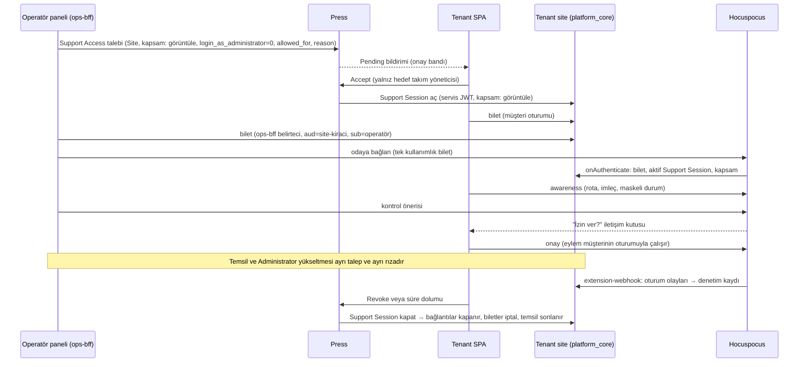

**Karar:** Superadmin paneli olmalıdır; Press (v0.155.3, `8493bf8`) plan, abonelik, kullanım ölçümü, fatura, ön ödemeli kredi defteri, modül aboneliği, kart tahsilatı ve rızaya dayalı destek erişimi için **ticari kayıt sistemi** olarak yeter, ancak cari hesap, resmi muhasebe, e-Fatura/e-Arşiv, helpdesk, CRM, TRY/KDV, iyzico ve EFT için hiçbir şey sunmaz; bu işleri Press'in kendisi de dış bir ERPNext'e devreder (`create-fc-invoice`, `delete-fc-team` çağrıları repoda vardır, alıcıları yoktur). İdeal kurulum üç evdir: Press = kontrol düzlemi + faturalama motoru; operasyon sitesi = sahibin kendi ERPNext v16 sitesi (dogfooding) ve muhasebenin tek doğrusu; superadmin paneli = aynı React kabuğunun iki kaynağı birleştiren operatör modu.

## Üç ev: Press · Superadmin paneli · Operasyon sitesi

| İş | Ev | Nasıl |
| --- | --- | --- |
| CRM (lead → fırsat → müşteri) | Operasyon sitesi | Frappe CRM `main` (frappe &gt;=15,&lt;17); `Account Request` → `CRM Lead`, ilk ödeme → `convert_to_deal`; Deal Won → `press_tr.api.ops.create_team` |
| Helpdesk (ticket, SLA, bilgi bankası) | Operasyon sitesi | Frappe Helpdesk `main` (+ `telephony`); `HD Ticket` press\_team/press\_site alanları; tenant widget → agent servisi → `hd_ticket.api.new` eşdeğeri |
| Cari hesap (müşteri kartı, bakiye, ekstre) | Operasyon sitesi | `Customer` (custom\_press\_team, tax\_id, tax\_office) + `Sales Invoice` + `Payment Entry` + GL; `Process Statement Of Accounts` ile aylık ekstre |
| Muhasebeleştirme, KDV, e-Fatura/e-Arşiv | Operasyon sitesi | `create-fc-invoice` alıcısı Sales Invoice üretir; entegratör köprüsü e-belge gönderir; PDF `fetch_invoice_pdf` ile Press'e döner |
| Plan, abonelik, ölçüm, dönemsel fatura | Press | `Site Plan`/`Subscription`/`Usage Record`/`Invoice`; `press_tr` (yeni Press eklenti app'i) ile TRY ve KDV yaması |
| AI kredisi ve ek kredi | Press (+ Agent servisi) | `Balance Transaction` defteri; yükleme `Prepaid Credits` Invoice; tüketim Agent servisinden `Usage Record` (`AI Credit Plan`) |
| Modül satın alma (CronHR, CRM, Webshop) | Press | `Marketplace App Plan` (price\_try) → `Marketplace App Subscription` → site\_config `sk_{app}` + `subscription_update_hook` |
| iyzico kart ödemesi | Press | Stripe/Razorpay deseni: `Iyzico Webhook Log` (guest handler, `X-IYZ-SIGNATURE-V3`), `Iyzico Payment Record`, Checkout Form (tek seferlik) |
| EFT/havale | Operasyon sitesi → Press | `Bank Statement Import` → `Bank Transaction Rule` (referans kodu) → `Payment Entry`; ardından `press_tr.api.ops.record_bank_transfer` |
| Cari işlemler (mutabakat, iade, avans) | Operasyon sitesi + Press | iyzico hak ediş CSV (SFTP) ↔ Payment Entry; iade `press_tr.api.ops.refund_invoice` → negatif BT → `is_return` Sales Invoice |
| Tahsilat/askıya alma (dunning) | Press | `suspend_sites.execute` (\*/30, 14 gün), `Payment Due Extension`; ERPNext `Dunning` yalnız resmi ihtar |
| Müşteri 360 | Superadmin paneli | Salt okur birleştirme: `press.api.client.get/get_list` + `platform_core.api.ops.customer_360(team)` (yeni), `ops-bff` üzerinden; kiracı sitesi çağrılmaz; yazma sahibi sisteme gider |
| Temsil (impersonation) | Press + tenant sitesi | Ayrı kapsam ve rıza: belirli kullanıcının rızasıyla `user.impersonate` veya kapsamı daraltılmış destek kullanıcısı; Administrator yalnız ayrı yükseltme rızasıyla (SA-44, K-19) |
| Co-browsing / uzaktan yardım | Tenant sitesi + Hocuspocus | Paylaşılan ekran durumu (rota, filtre, kaydırma, seçim, maskeli satır özeti, form taslağı) + imleç/presence; kontrol önerileri müşteri onayıyla, müşterinin oturumunda çalışır (SA-42..SA-44) |
| Operatör kimliği | Keycloak → Press + ops sitesi | Operatör realm rolleri → Press System User hesapları + ops sitesi rolleri; operatör başına API key |
| Infra ve AI destekli operasyon | Press Desk + Press MCP | `enable_mcp`, System Manager; yalnız ops-admin ve Hüseyin Cengiz |

## Superadmin paneli (operatör modu)

Panel, tenant SPA ile aynı kabuktur ve yalnız özel ağdaki `operator.<marka>.com.tr` origin'inde sunulur (G-119); Keycloak 'platform' realm'indeki `platform-operator` grubunun `ops-admin`, `ops-billing`, `ops-support`, `ops-finance` rolleri kabuğu operatör moduna alır. Ekranlar: **Müşteri 360** (Team, Site'lar, Subscription, Invoice, Balance Transaction, Support Access + Customer, açık Sales Invoice, son Payment Entry, HD Ticket, CRM Deal), **Tahsilat ve kredi** (bakiye, BT ekstresi, kredi tahsisi, bekleyen EFT kuyruğu, iade), **Abonelik ve modüller**, **Destek** (ticket + Support Access + Support Session), **Tahsilat aşaması** (Unpaid → Suspended → Archive scheduled → Archived → Uncollectible), **KVKK denetim raporu**, **Gece mutabakat farkları**.

Press erişimi iki katmanlıdır ve gerekçesi koddur: `press.api.client` `get/set_value/delete/run_doc_method` Support Access'i tanır (client.py L246-260, L336-375), fakat başka takımın Team/Invoice/BT tekil yazması yalnız `frappe.local.system_user()` ile açılır (client.py L442-447, takım sahipliği ownership.py L80-105; v0.155.3). Bu yüzden **site düzeyi destek eylemleri** Press Support Agent + Accepted Support Access ile `press.api.client.run_doc_method` üzerinden, **ticari yazmalar** ise System User servis hesabı + `press_tr.api.ops` üzerinden yapılır. Operatör BFF'i (`ops-bff`; `operator.` origin'inde, operatör moduyla aynı origin'de, G-119) operatör başına Press API key/secret ve `X-Press-Team` başlığı kullanır; paylaşımlı anahtar yoktur. `press.api.client.get_list` + `skip_team_filter_for_system_user_and_support_agent` bayrağı Press Support Agent'a Support Access'siz çapraz-kiracı liste okuması verdiği için (client.py L164-170) bu rol KVKK envanterinde ayrıcalıklı sayılır ve her çağrı loglanır. Gerçek zamanlılık: panel verisi TanStack Query ile yenilenir; destek oturumu presence'ı Hocuspocus odasından gelir; ops sitesi `frappe.realtime` kanalı ticket güncellemeleri için kullanılır (doğrulanacak).

## Operasyon sitesi

Press'in sahibin kendi Team'inde ayrı bir Release Group ('ops') ile dağıttığı ERPNext v16.50 sitesidir. P2 finans çekirdeği: `erpnext@version-16`, platform core ve `press_tr_finance` (create-fc-invoice alıcısı, e-belge köprüsü); P6'da `crm@main` ve `helpdesk@main` (`telephony` zorunlu bağımlılık) eklenir. `develop` dalları `whatsapp` ve Python 3.14 ister; v17 geçişi ayrı karardır.

**Veri modeli.** `Team` ↔ `Customer` bire bir; Customer adı `Team.billing_name`'dir çünkü `Team.update_billing_details_on_frappeio` uzak Customer'ı bu adla yeniden adlandırır (team.py L910-937). Customer üzerinde `custom_press_team` (tekil), `tax_id` (VKN/TCKN), `tax_office`, `customer_type`, `custom_efatura_mukellef`; Press tarafında aynı alanlar `press/press/custom/address.json` kalıbıyla eklenir ve `create-fc-invoice` yüküne girer. `HD Customer`, `ERPNext HD Settings.enabled=1` ile Customer'dan otomatik aynalanır; `CRM Organization` `custom_press_team` ile bağlanır. Customer yaratmanın tek sahibi Team olayıdır; `ERPNext CRM Settings.create_customer_on_status_change` kapalıdır.

**Press → Sales Invoice.** `sync_paid_invoices_to_frappeio` (daily\_long) `status=Paid`, `transaction_amount>0`, `frappe_invoice` boş, `Team.enabled=1` faturaları alır; `create_invoice_on_frappeio` gövdeyi **form-encoded** gönderir, `team`/`address`/`invoice` alanları JSON string'dir ve dönen `message` Sales Invoice adıdır (invoice.py L1228-1236). Alıcı `frappe.parse_json` uygular, Press Invoice adına göre idempotent çalışır (`PLAN-/APP-/AI-CREDIT-/SERVICE-` Item eşlemesi), Press API kullanıcısına Sales Invoice read+print verir ve `Press Settings.print_format` adı sitede var olur. İki sonuç bağlayıcıdır: (1) `transaction_amount` yalnız Stripe/Razorpay yollarında dolar ve `options: INR`'dir; iyzico ve EFT yolları bu alanı doldurmadan senkron hiç tetiklenmez; (2) kredi ile kapanan Subscription faturaları `amount_paid==0` olduğundan asla senkronlanmaz; bu boşluğun hangi belgeyle kapanacağı aşağıdaki finans olay–belge matrisinde mali müşavir kararına (K-13) bağlıdır.

**iyzico/EFT → Payment Entry.** iyzico hak edişi `report.iyzipay.com` SFTP CSV'lerinden (`transaction`, `cutoff`, `settlement`) `Iyzico Settlement Line` ara doctype'ına çekilir; ödeme başına komisyon kesintili Payment Entry, payout toplamı Bank Transaction ile eşleşir; anahtar `conversationId` = Press Invoice adı. EFT: banka ekstresi → `Bank Transaction` → `Bank Transaction Rule` ile `custom_payment_reference` (PRS-...) yakalanır → Payment Entry → `Bank Reconciliation Tool`; kesinleşince `press_tr.api.ops.record_bank_transfer` çağrılır.

### Finans olay–belge matrisi (SA-41)

Her ekonomik olay tek tetikle tek belgeye gider; vergi ve belge zamanlaması mali müşavir kararıdır (K-13). Bu tablo vergi veya muhasebe politikası seçmez.

| Olay | Press kaydı | Operasyon sitesi belgesi | Tetik ve idempotensi anahtarı | Karar |
| --- | --- | --- | --- | --- |
| Hizmet dönemi tahakkuku | Usage Record → taslak Invoice | Fatura kesinleşince (aşağıda) | `create_usage_records`; Usage Record adı | Press yerel |
| Fatura kesinleşmesi | Invoice finalize (Unpaid/Paid) | Sales Invoice + e-belge: kesinleşmede ya da yalnız ödenince | finalize veya Paid; Press Invoice adı (`custom_press_invoice` tekil) | K-13 |
| Kart tahsilatı (iyzico) | Invoice Paid, Iyzico Payment Record | Payment Entry; hak ediş mutabakatı (SA-33) | callback + retrieve; `conversationId` = Press Invoice | Press yerel |
| EFT/havale | `press_tr.api.ops.record_bank_transfer` | Bank Transaction → Payment Entry | ekstre eşleşmesi (PRS- referansı); banka referansı | SA-8, SA-34 |
| Kredi yükleme | Balance Transaction (Prepaid Credits) | A: satış faturası / B: alınan avans; ikisi birden asla | ödeme onayı; BT adı | K-13 |
| Kredi tüketimi | Usage Record, kredi ile kapanan Invoice (`amount_paid` 0) | A: ek belge yok / B: aylık gelir tahakkuku (Journal Entry) | ay sonu; takım + dönem | K-13 |
| İade / kısmi iade | `press_tr.api.ops.refund_invoice`, negatif BT | `is_return` Sales Invoice + e-belge iptal/iade | iade onayı; iade kimliği | SA-9 |
| İtiraz | Payment Dispute | Şüpheli alacak kaydı | itiraz bildirimi; itiraz kimliği | Finans |

Değişmezler: bir Press Invoice'a en çok bir Sales Invoice; kredi yüklemesi ya satış faturası ya avans olur; aynı ekonomik olay iki yoldan kaydedilmez; gece mutabakatında fark sıfır.

**e-Fatura konumu.** ERPNext v16 `regional/turkey/setup.py` boş fonksiyondur, `country_wise_tax.json` yalnız eski "VAT 18%" kaydını taşır, UBL-TR üreticisi yoktur; buna karşılık `tr_chart_of_accounts.json` doğrulanmıştır. KDV %20/%10/%1 şablonları elle tanımlanır; e-belge, Sales Invoice submit sonrası entegratör köprüsünden gider (VKN + mükellef → e-Fatura, aksi e-Arşiv; ETTN/durum/XML Sales Invoice'ta). `logedosoft/ERPNext-Turkish-Delight` `TD EInvoice Integrator/Settings` kalıbı (Uyumsoft, Bien Teknoloji) referanstır; v16 uyumu doğrulanmamıştır (doğrulanacak).

**Helpdesk ve CRM akışları.** Tenant widget bağlamı (site, ürün, sürüm, kullanıcı) toplar; agent servisi servis kullanıcısıyla HD Ticket açar (`raised_by` tenant e-postası, Contact ↔ HD Customer Member). SLA plan kademesine göre koşullu `HD Service Level Agreement`, atama ürün bazlı `HD Team` + Assignment Rule. CRM: `Account Request` → `CRM Lead`; `Product Trial Request` 'Site Created' → 'Trial'; ilk Paid Invoice → `convert_to_deal` + Won.

## İzinli destek oturumu

**Yaşam döngüsü.** HD Ticket → operatör Support Access talebi (`resources=[Site]`, kapsam, `allowed_for` 3–168 saat, `reason`; Administrator yükseltmesi dışındaki her talepte `login_as_administrator=0`) → tenant SPA onay bandı (Pending talep 7 gün sonra saatlik `expire_pending_requests` işiyle düşer; Press v0.155.3) → Accepted → Press, kiracı sitesindeki `platform_core`'da servis JWT'siyle `Support Session` açar (operatör, kapsam, başlangıç/bitiş, rıza sürümü) → bitiş: süre dolumu, müşteri Revoke, operatör Forfeit. Temsil ve Administrator yükseltmesi aynı talebin parçası değildir; her biri ayrı talep ve ayrı rızadır.

**Kapsamlar ve izinler (SA-42..SA-44).** Bu bölüm tasarım sözleşmesidir; uygulanmadı ve test edilmedi. Görüntüleme rızası yönetici erişimine dönüşmez; her kapsam ayrı rıza, ayrı süre ve sunucuda zorlanan ayrı izindir.

| Kapsam | Operatör ne görür / yapar | Rıza ve süre | Sunucu zorlaması |
| --- | --- | --- | --- |
| Görüntüle | Paylaşılan ekran durumu: rota, filtre, sıralama, sayfa, kaydırma, seçim, maskeli satır özeti, form taslağının maskesiz alanları, imleç; kiracı API oturumu yok | Support Access (3–168 saat) | Bilet + aktif Support Session; maskeleme kaynakta (SA-43) |
| Takip | Operatör görünümü müşterininkine kilitlenir | Ayrı onay | Aynı |
| Kontrol | Operatör eylem önerir; eylem müşterinin tarayıcısında, müşterinin oturumu ve yetkisiyle çalışır; varsayılan tek tek onay, silme/iptal/submit/ücretli eylem her zaman ayrı onay; tek kontrol kilidi | Ayrı onay, kısa süre (K-33) | Öneri ve onaylar denetimde; kayıtlar `support_session` ve operatörle işaretli (SA-44) |
| Temsil | Ayrı oturum: belirli kullanıcının rızasıyla `platform_core` kapısından `user.impersonate` veya kapsamı daraltılmış destek kullanıcısı; operatöre Administrator oturumu verilmez. Administrator (`login_as_administrator=1`, `Site.login_as_admin`) yalnız ayrı, daha kısa süreli yükseltme talebiyle | Ayrı rıza, en kısa süre (K-19, K-33) | Her istekte aktif Support Session ve kapsam; Security Alert (SA-28) |

- **Gösterge:** müşteri ekranında sürekli görünür bant: operatör adları, kapsam, kalan süre, klavyeyle erişilen "Oturumu bitir".
- **Çoklu destekçi:** her operatörün ayrı izni vardır; kontrol kilidi tek operatördedir.
- **Kopma:** müşteri bağlantısı koparsa kontrol hemen düşer (fail-closed) ve yeniden verilmeden dönmez; operatör koparsa kilit bırakılır.
- **İptal:** Revoke veya süre dolumu Hocuspocus bağlantılarını sunucudan kapatır, yeniden kimlik doğrulamayı reddeder, temsil oturumunu sonlandırır, bekleyen önerileri düşürür ve biletleri iptal listesine alır. Kabul: 2 sn içinde WebSocket kapanır, temsil oturumundaki API çağrısı 401/403.
- **Maskeleme:** permlevel ile gizli alanlar, uygulamanın `support_mask_fields` listesi ve kişisel veri sınıfları (TCKN, IBAN, kart, maaş) ağa hiç çıkmaz.

**Hocuspocus.** v4.7.0 (MIT) Hetzner'de ayrı servis (owner: Hüseyin Cengiz): Node + reverse proxy TLS, `extension-redis` (çoklu düğüm), `extension-webhook` (olaylar Press/ops denetim kaydına), `onAuthenticate` kiracı sitesinin (`platform_core`) bastığı tek kullanımlık bileti (G-148), aktif Support Session'ı ve kapsamı doğrular. Biletleri tek yayıncı basar: müşteri kendi site oturumuyla, operatör ise operatör BFF'inin (`ops-bff`) kendi belirtecinden token exchange ile aldığı `aud=site-<kiracı>` belirteciyle (`sub` = operatör; G-59, G-82) aynı siteden alır; operatörün kiracı API oturumu yoktur; Origin denetimi bilet türüne bağlıdır: müşteri bileti yalnız basan kiracının kayıtlı origin'lerinden, operatör bileti yalnız `operator.` origin'inden (`ops.` listede yok; G-119); oda `support-session:{site}:{id}`; oturum kapanınca oda silinir. İptal ve süre dolumunda sunucu açık bağlantıları kapatır ve yeniden kimlik doğrulamayı reddeder; imleç akışı saklanmaz (K-18).

**Denetim ve KVKK.** Support Access, Support Session, Team Member Impersonation, Site Activity, Activity Log, HD Ticket ve AI denetim kayıtları tek raporda; `Legal Document Acceptance` (belge, sürüm, içerik hash'i, kullanıcı, zaman) rızayı sürümler; saklama/legal hold matrisi silme işlerini (`Team Deletion Request`, yedek silme, anonimleştirme) durdurabilir.

## Press'te kalan işler

- Plan kataloğu ve fiyatlandırma (`Site Plan`, `Marketplace App Plan`, `Server Plan`), TRY alanlarıyla.
- Abonelik ve ölçüm: `Subscription.create_usage_records` (\*/15), `Usage Record`, aylık `Invoice` üretimi ve `finalize_*` zamanlayıcıları.
- Kredi defteri: `Balance Transaction`, `Team.allocate_credit_amount`, FIFO `apply_credit_balance`.
- Kart tahsilatı: iyzico webhook/payment record, saklı kart veya abonelik ürünü.
- Dunning: `suspend_sites.execute`, `Payment Due Extension`, arşiv ve yedek saklama (yapılandırılabilir hale getirilmiş).
- Modül aboneliği ve aktivasyon sinyali (`Marketplace App Subscription`, `subscription_update_hook`).
- Rıza ve süre modeli: `Support Access` (kapsam ve süre), `Site.login_as_admin` (yalnız Administrator yükseltmesi), `Team.impersonate`.
- Müşteri silme akışı: `Team Deletion Request` (`process_team_deletion_requests` cron 15 2,4 \* \* \*).
- Partner programı: `Partner Lead`, `Partner Tier`, `Payout Order`, Paid By Partner.
- Altyapı: bench/server/site aksiyonları, Press Desk ve Press MCP (infra allow-list).

## Entegrasyon sözleşmeleri

- **Press → ops sitesi (Press istemci kodu hazır; alıcı `press_tr_finance`, `override_whitelisted_methods` ile bağlı, G-126):** `POST {frappe_url}/api/method/create-fc-invoice` (form-encoded, JSON string alanlar; `message` = Sales Invoice adı); `DELETE {frappe_url}/api/method/delete-fc-team`; `rename_doc("Customer", eski, yeni)`; `frappe.utils.print_format.download_pdf` (Sales Invoice, `print_format`).
- **Press → ops sitesi (`press_ops_bridge`, yeni):** doc\_events `Team` `after_insert/on_update`, `Balance Transaction` on\_submit, `Marketplace App Subscription` on\_update, `Support Access` on\_update → `frappe.enqueue` + `Integration Request` günlüğü + idempotensi anahtarı (doctype:name:modified); Press Webhook takım kapsamlı ve yalnız 4 infra olayı sunduğu için kullanılmaz.
- **Ops sitesi / Agent servisi → Press (`press_tr.api.ops`, System User only):** `record_bank_transfer`, `allocate_credit`, `refund_invoice`, `extend_payment_due`, `suspend_team`/`unsuspend_team`, `create_team`, `create_support_access_on_behalf`; her çağrı `reason` + Comment + Version.
- **Agent servisi → Press:** `Usage Record` (plan\_type `AI Credit Plan`, interval Daily) System User servis hesabıyla; öncesinde `Team.get_balance` ve `spending_limit`.
- **Tenant app → Press (guest, secret\_key):** `press.api.developer.marketplace.get_subscription_info`, `change_site_plan`.
- **Shell → Press (X-Press-Team):** `press.api.billing.past_invoices`, `upcoming_invoice`, `get_balance_credit`; `press_tr.api.billing.create_iyzico_checkout_form`; `press.api.access.status`; Support Access Accept/Reject `run_doc_method`.
- **Shell → ops sitesi (agent servisi relay; kiracının bilet yolu, K-20):** HD Ticket aç/listele.
- **Operatör modu → ops sitesi (`ops-bff`, `aud=site-ops`; G-59):** `platform_core.api.ops.customer_360(team)` (yeni), operatörün Keycloak kimliği ve operasyon sitesi rolleriyle.
- **iyzico → Press:** HPP webhook (`token`, `iyziEventType`, `status` SUCCESS/INIT\_\*/PENDING\_CREDIT/FAILURE), `X-IYZ-SIGNATURE-V3`; 15 dk aralıkla 3 yineleme; SUCCESS sonrası CF retrieve zorunlu.
- **Hocuspocus → kiracı sitesi ve ops:** `extension-webhook` oturum olayları; `onAuthenticate` → kiracı sitesi (`platform_core`): bilet, `Support Session` durumu ve kapsamı.
